# Asset inventory

Generated from [`models/catalog.json`](../../models/catalog.json) by `tools/catalog_md.py`. **74 assets**: 42 already in the game, 32 new Meshy models waiting in the Blender inbox.

## Where the new Meshy models are

The 32 models sent from Meshy on 2026-09-28 had arrived **inside the open Revolution Blender file** (`revolution.blend`, collection `RR_Revolution`), all at the origin with generic names. They were:

- moved into their own collection **`Meshy_Inbox`**, so the next Revolution export cannot pick them up by accident;
- renamed `mx_<what it is>` (the original Meshy name is kept on each object as `rr_source`, with triangle and texture info as `rr_tris` / `rr_textures`);
- saved to their own library file **`RydensRacers-Blender/meshy_inbox/meshy_inbox.blend`** (2.3 GB: the raw Meshy meshes are 0.5 to 8 million triangles each). The Revolution file itself was not re-saved.

None of them is in the game yet: every one except five needs a game-ready export (decimation to the target budget, 1024/2048 texture caps, LODs) before use. Nothing was added to the playable car list.

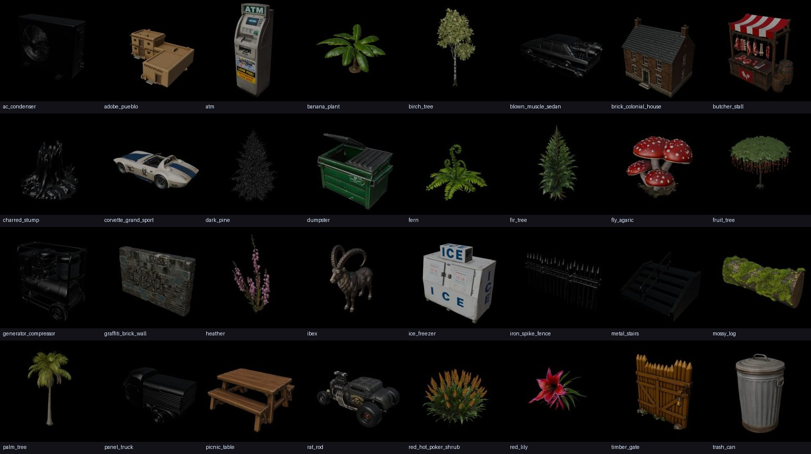

## New Meshy models (inbox)

| | id | category | role | tris now | target | textures | best tracks | notes |
|---|---|---|---|---|---|---|---|---|
| 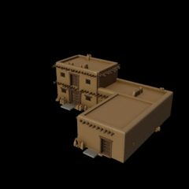 | `mx_adobe_pueblo` | Buildings | hero | 1.6M | 12k | 2048 x3 | Mojave Mesa | Adobe pueblo block - Route 99 desert settlement / trading post. |
| 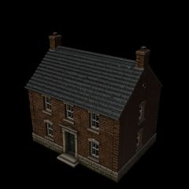 | `mx_brick_colonial_house` | Buildings | hero | 760k | 15k | 2048 x3 | Revolution | Georgian brick house with chimneys - big upgrade over the procedural houses in Yorktown/Trenton. |
| 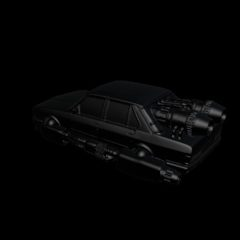 | `mx_blown_muscle_sedan` | Decorative vehicles | filler | 858k | 15k | 4096/2048 | Alondra Blvd, Sweet Justice | Black sedan with blower - parked outside shops/houses. Candidate playable car. |
| 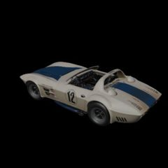 | `mx_corvette_grand_sport` | Decorative vehicles | hero | 1.4M | 25k | 2048 x3 | Pacifica, Sweet Justice | #12 Grand Sport racer - paddock/festival display at Pacifica. Candidate playable car. |
| 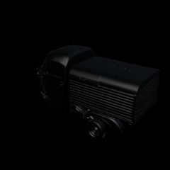 | `mx_panel_truck` | Decorative vehicles | filler | 694k | 15k | 2048 x4 | Alondra Blvd, Neon Foundry, Sweet Justice | Vintage black panel/delivery truck - parked on side streets, foundry yard. |
| 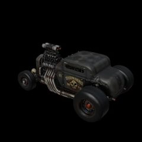 | `mx_rat_rod` | Decorative vehicles | hero | 1.7M | 25k | 2048 | Mojave Mesa, Honky Tonk, Neon Foundry | Blown rat rod - parked hero at a Route 99 garage or the Neon pits. Candidate playable car (your call). |
| 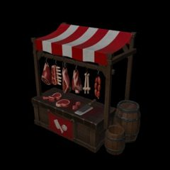 | `mx_butcher_stall` | Hero props | filler | 797k | 8k | 4096 | Revolution | Colonial market stall - Lexington green / Yorktown market. |
|  | `mx_ibex` | Hero props | hero | 509k | 8k | 2048 x3 | Mojave Mesa | Mountain goat/ibex - perch it on a Mojave Mesa rock outcrop (bighorn stand-in). |
| 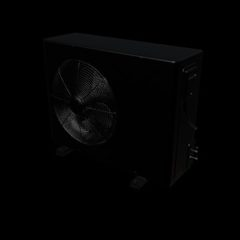 | `mx_ac_condenser` | Infrastructure | filler | 932k | 2k | 2048 | Alondra Blvd, Sweet Justice, Neon Foundry | AC condenser - beside houses, shops and rooftops. |
| 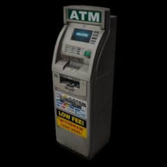 | `mx_atm` | Infrastructure | filler | 164k | 3k | 2048 x3 | Alondra Blvd, Sweet Justice | Street ATM - storefronts on Alondra/Compton. |
| 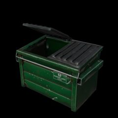 | `mx_dumpster` | Infrastructure | filler | 9k | 9k | 2048 x3 | Alondra Blvd, Sweet Justice, Neon Foundry, Mojave Mesa | Game-ready (9k). Alleys, lots, foundry yard. |
| 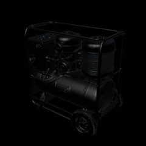 | `mx_generator_compressor` | Infrastructure | filler | 2.9M | 4k | 4096/2048 | Neon Foundry, Mojave Mesa, Alondra Blvd | Portable generator/compressor - work sites, foundry yard, gas station. |
| 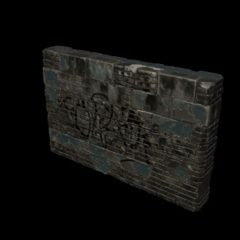 | `mx_graffiti_brick_wall` | Infrastructure | filler | 685k | 2k | 2048 x3 | Alondra Blvd, Sweet Justice, Neon Foundry | Graffiti brick wall panel - alleys, lots, underpasses. |
| 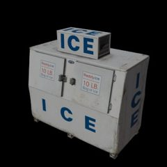 | `mx_ice_freezer` | Infrastructure | filler | 430k | 3k | 2048 x3 | Mojave Mesa, Sweet Justice, Alondra Blvd | Gas-station ICE freezer - Route 99 gas stop, liquor-store fronts. |
| 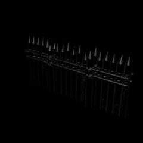 | `mx_iron_spike_fence` | Infrastructure | filler | 770k | 2k | 2048 x4 | Alondra Blvd, Sweet Justice | Wrought-iron fence section - front yards, lots. Tileable run. |
| 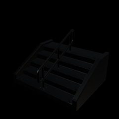 | `mx_metal_stairs` | Infrastructure | filler | 181k | 2k | 2048 x4 | Neon Foundry | Industrial steps with rail - Neon Foundry catwalks, grandstand access. |
| 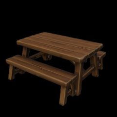 | `mx_picnic_table` | Infrastructure | filler | 10k | 10k | 2048 x3 | Pacifica, Mojave Mesa, Honky Tonk | Game-ready (10k). Pacifica overlooks, desert rest stop, camps. |
| 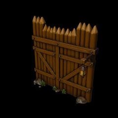 | `mx_timber_gate` | Infrastructure | filler | 940k | 6k | 2048 x3 | Revolution, Honky Tonk | Palisade gate with lantern - camp/fort entrances, ranch gates. |
| 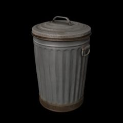 | `mx_trash_can` | Infrastructure | filler | 30k | 3k | 2048 x3 | Sweet Justice, Alondra Blvd, Pacifica, Neon Foundry | Galvanised trash can. Near game-ready (30k). |
| 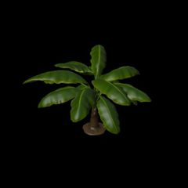 | `mx_banana_plant` | Vegetation | filler | 21k | 8k | 2048 x3 | Sweet Justice, Alondra Blvd, Pacifica | Already game-ready (21k). Yards, shop fronts, coastal gardens. |
| 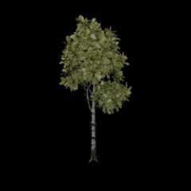 | `mx_birch_tree` | Vegetation | filler | 2.5M | 12k | 2048 x3 | Honky Tonk, Revolution | Birch/aspen. Saratoga autumn woods, Honky Tonk creek. |
| 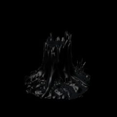 | `mx_charred_stump` | Vegetation | hero | 10k | 10k | 4096/2048 + emissive embers | Revolution, Mojave Mesa | Burnt stump with glowing embers (Bunker Hill / Charlestown burning). Game-ready tris; cap textures. |
| 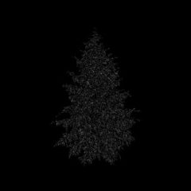 | `mx_dark_pine` | Vegetation | filler | 2.0M | 10k | 4096/2048 | Revolution, Mojave Mesa | Sparse dark pine (needle geometry). Heavy 4096 textures - cap to 1024. |
|  | `mx_fern` | Vegetation | filler | 1.3M | 2k | 2048 x3 | Revolution, Pacifica, Honky Tonk | Understory: swamp causeway, cliff gardens. |
| 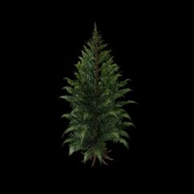 | `mx_fir_tree` | Vegetation | filler | 2.8M | 12k | 2048 x3 | Revolution, Honky Tonk, Pacifica | Fir. Trenton/Delaware winter, Pacifica headland. |
|  | `mx_fly_agaric` | Vegetation | filler | 3.2M | 2k | 2048 x3 | Revolution, Honky Tonk | Toadstool cluster. Saratoga woods floor / swamp easter egg. |
| 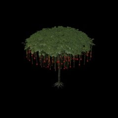 | `mx_fruit_tree` | Vegetation | hero | 8.2M | 15k | 2048 | Sweet Justice, Alondra Blvd, Pacifica | Umbrella tree with hanging red fruit. 8.2M tris - heaviest asset; bake to a low-poly + cards. |
| 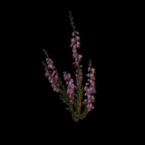 | `mx_heather` | Vegetation | filler | 1.6M | 2k | 2048 x3 | Pacifica, Revolution | Coastal heather tufts along the Pacifica cliff road. |
| 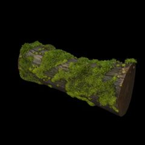 | `mx_mossy_log` | Vegetation | filler | 3.4M | 3k | 2048 x3 | Revolution, Honky Tonk | Fallen mossy log: swamp causeway, creek banks. |
| 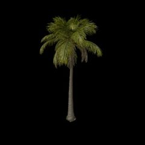 | `mx_palm_tree` | Vegetation | filler | 2.3M | 12k | 2048 | Pacifica, Sweet Justice, Alondra Blvd | Tall fan palm. Better silhouette than the 3k-tri palm prop; needs a card/foliage-aware reduction, not a plain decimate. |
| 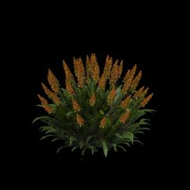 | `mx_red_hot_poker_shrub` | Vegetation | filler | 5.2M | 3k | 2048 x3 | Pacifica, Sweet Justice | Flowering shrub (kniphofia) - coastal/Californian gardens. |
|  | `mx_red_lily` | Vegetation | filler | 850k | 2k | 2048 x3 | Sweet Justice, Alondra Blvd | Flower accent for planters and front yards. |

**Ready now or nearly ready** (under 30k triangles): `mx_dumpster` (9k), `mx_charred_stump` (10k), `mx_picnic_table` (10k), `mx_banana_plant` (21k), `mx_trash_can` (30k). They still need their 2048/4096 textures capped.

**Heaviest:** `mx_fruit_tree` (8.2M), `mx_red_hot_poker_shrub` (5.2M), `mx_mossy_log` (3.4M), `mx_fly_agaric` (3.2M), `mx_generator_compressor` (2.9M, 4096 textures). Foliage models need a foliage-aware reduction (alpha cards or impostors), because a plain decimation to 10k turns leaves into blobs.

**Candidate playable cars (your call, not added):** `mx_corvette_grand_sport`, `mx_rat_rod`, `mx_blown_muscle_sedan`. They are classified as decorative vehicles for now: parked displays at the Pacifica festival, a Route 99 garage, Alondra side streets.

## Per-track shopping list

- **Sweet Justice**: new candidates: `mx_palm_tree`, `mx_fruit_tree`, `mx_banana_plant`, `mx_red_hot_poker_shrub`, `mx_red_lily`, `mx_iron_spike_fence`, `mx_graffiti_brick_wall`, `mx_ac_condenser`, `mx_ice_freezer`, `mx_atm`, `mx_dumpster`, `mx_trash_can`, `mx_panel_truck`, `mx_blown_muscle_sedan`, `mx_corvette_grand_sport`. In game today: `env_sweet`, `grandstand`, `rrsign`, `knives`, `hijoe`, `watch_shop`, `shoe_factory`, `watch_sign`, `claw_can`, `echelon_can`, `palm`.
- **Mojave Mesa**: new candidates: `mx_dark_pine`, `mx_charred_stump`, `mx_ibex`, `mx_adobe_pueblo`, `mx_generator_compressor`, `mx_ice_freezer`, `mx_dumpster`, `mx_picnic_table`, `mx_rat_rod`. In game today: `env_mesa`, `knives`, `hijoe`, `range_sign`.
- **Pacifica**: new candidates: `mx_palm_tree`, `mx_fir_tree`, `mx_fruit_tree`, `mx_banana_plant`, `mx_fern`, `mx_heather`, `mx_red_hot_poker_shrub`, `mx_trash_can`, `mx_picnic_table`, `mx_corvette_grand_sport`. In game today: `env_coast`, `knives`, `hijoe`.
- **Neon Foundry**: new candidates: `mx_graffiti_brick_wall`, `mx_metal_stairs`, `mx_generator_compressor`, `mx_ac_condenser`, `mx_dumpster`, `mx_trash_can`, `mx_rat_rod`, `mx_panel_truck`. In game today: `env_neon`, `knives`, `hijoe`, `shoe_factory`.
- **Alondra Blvd**: new candidates: `mx_palm_tree`, `mx_fruit_tree`, `mx_banana_plant`, `mx_red_lily`, `mx_iron_spike_fence`, `mx_graffiti_brick_wall`, `mx_generator_compressor`, `mx_ac_condenser`, `mx_ice_freezer`, `mx_atm`, `mx_dumpster`, `mx_trash_can`, `mx_panel_truck`, `mx_blown_muscle_sedan`. In game today: `env_alondra`, `knives`, `hijoe`, `mrblack`, `ak`, `watch_shop`, `shoe_factory`, `watch_sign`, `range_sign`, `claw_can`, `echelon_can`.
- **Honky Tonk**: new candidates: `mx_birch_tree`, `mx_fir_tree`, `mx_fern`, `mx_fly_agaric`, `mx_mossy_log`, `mx_timber_gate`, `mx_picnic_table`, `mx_rat_rod`. In game today: `grandstand`, `rrsign`, `hijoe`, `trio`, `donkeys`, `solocup`, `dolly`, `church`, `gate`.
- **Revolution**: new candidates: `mx_birch_tree`, `mx_fir_tree`, `mx_dark_pine`, `mx_fern`, `mx_heather`, `mx_fly_agaric`, `mx_mossy_log`, `mx_charred_stump`, `mx_brick_colonial_house`, `mx_butcher_stall`, `mx_timber_gate`. In game today: `env_revolution`, `knives`, `hijoe`, `trio`, `donkeys`, `rv_troops`, `rv_props`, `rv_heroes`.

## Already in the game

### Playable vehicles

| id | file | tris | draw prims | textures | texture MB | file MB | tracks | notes |
|---|---|---|---|---|---|---|---|---|
| `hellcat` | `models/cars/hellcat.glb` | 30k | 1 | ['512x512:jpeg', '1024x1024:jpeg', '256x256:jpeg'] | 0.29 | 1.65 | all | Colonial Hellcat (CordIsLoud) |
| `brcc` | `models/cars/rotor.glb` | 30k | 1 | ['512x512:jpeg', '1024x1024:jpeg', '256x256:jpeg'] | 0.37 | 1.6 | all | BRCC (JT) |
| `fdc` | `models/cars/rrpickup.glb` | 29k | 1 | ['512x512:jpeg', '1024x1024:jpeg', '256x256:jpeg'] | 0.39 | 2.12 | all | FDC pickup |
| `bpd` | `models/cars/bpd_69.glb` | 30k | 5 | ['1024x1024:jpeg', '512x512:jpeg', '256x256:jpeg'] | 0.32 | 1.39 | all | BPD 69 (Rich) |
| `concord` | `models/cars/concordance.glb` | 30k | 5 | ['1024x1024:jpeg', '512x512:jpeg', '256x256:jpeg'] | 0.34 | 1.36 | all | Concordance |
| `donut` | `models/cars/donut_patrol.glb` | 30k | 5 | ['1024x1024:jpeg', '512x512:jpeg', '256x256:jpeg'] | 0.51 | 1.57 | all | Donut Patrol |
| `duck` | `models/cars/duck_plasma.glb` | 30k | 5 | ['1024x1024:jpeg', '512x512:jpeg', '256x256:jpeg'] | 0.37 | 1.32 | all | Duck Plasma (Nic) |
| `gt44` | `models/cars/gt40.glb` | 30k | 5 | ['1024x1024:jpeg', '512x512:jpeg', '256x256:jpeg'] | 0.31 | 1.18 | all | GT40 (menu showcase + graphics benchmark car) |
| `missile` | `models/cars/missile_commander.glb` | 29k | 5 | ['1024x1024:jpeg', '512x512:jpeg', '256x256:jpeg'] | 0.32 | 1.55 | all | Missile Commander |
| `leopard` | `models/cars/night_leopard.glb` | 30k | 5 | ['1024x1024:jpeg', '512x512:jpeg', '256x256:jpeg'] | 0.3 | 1.33 | all | Black Lightning (Pix) |
| `trout` | `models/cars/trout_protocol.glb` | 30k | 5 | ['1024x1024:jpeg', '512x512:jpeg', '256x256:jpeg'] | 0.4 | 1.24 | all | Trout Protocol |
| `lightning` | `models/cars/white_lightning.glb` | 40k | 5 | ['2048x2048:jpeg', '64x64:jpeg', '256x256:jpeg'] | 1.08 | 3.04 | all | White Lightning GT3 (Tackett) - 2048 textures, heaviest car |
| `genlee` | `models/cars/general_lee.glb` | 24k | 5 | ['1024x1024:jpeg', '512x512:jpeg', '256x256:jpeg'] | 0.39 | 1.47 | Honky Tonk | General Lee (Nolan); also the Dukes-jump hero on Honky Tonk Highway |

### Track environments

| id | file | tris | draw prims | textures | texture MB | file MB | tracks | notes |
|---|---|---|---|---|---|---|---|---|
| `env_sweet` | `models/env/env_sweet.glb` | 76k | 38 | ['1024x1024:jpeg', '512x512:jpeg', '2048x2048:jpeg', '4096x4096:jpeg', '512x64:jpeg', '1024x128:jpeg'] | 5.02 | 8.06 | Sweet Justice | Sweet Justice Circuit environment |
| `env_mesa` | `models/env/env_mesa.glb` | 302k | 122 | ['512x64:jpeg', '512x512:jpeg', '2048x2048:jpeg', '512x1024:jpeg', '1024x1024:jpeg', '1024x512:jpeg'] | 2.56 | 14.18 | Mojave Mesa | Mojave Mesa Run environment |
| `env_coast` | `models/env/env_coast.glb` | 268k | 110 | ['1024x1024:jpeg', '512x64:jpeg', '2048x2048:jpeg', '512x1024:jpeg', '512x64:png', '1024x512:jpeg'] | 2.51 | 11.83 | Pacifica | Pacifica Cliffs environment (graphics benchmark) |
| `env_neon` | `models/env/env_neon.glb` | 107k | 105 | ['512x512:jpeg', '256x64:jpeg', '2048x2048:jpeg', '2048x1024:jpeg', '600x600:jpeg', '2048x512:jpeg'] | 2.4 | 8.73 | Neon Foundry | Neon Foundry Nights environment (runtime LED/wet-road shaders) |
| `env_alondra` | `models/env/env_alondra.glb` | 369k | 292 | ['2048x2048:jpeg', '512x512:jpeg', '1024x1024:png', '256x256:png', '1024x1024:jpeg', '256x256:jpeg'] | 5.36 | 16.21 | Alondra Blvd | Alondra Boulevard environment |
| `env_revolution` | `models/env/env_revolution.glb` | 587k | 395 | ['1024x1024:jpeg', '256x512:jpeg', '512x512:jpeg', '256x256:jpeg', '2048x2048:jpeg', '2048x1024:jpeg'] | 4.13 | 24 | Revolution | Revolution environment + runtime layout JSON |
| `showroom` | `models/env/showroom.glb` | 2k | 10 | [] | 0 | 0.11 | Menu | Neon showroom (menu / garage) |

### Buildings

| id | file | tris | draw prims | textures | texture MB | file MB | tracks | notes |
|---|---|---|---|---|---|---|---|---|
| `church` | `models/props/church.glb` | 30k | 1 | ['2048x2048:jpeg', '1024x1024:jpeg', '512x512:jpeg'] | 1.85 | 3.55 | Honky Tonk | Country church |
| `watch_shop` | `models/props/watch_shop.glb` | 26k | 1 | ['1024x1024:jpeg', '2048x2048:jpeg', '512x512:jpeg'] | 1.63 | 2.92 | Sweet Justice, Alondra Blvd | Watch shop |
| `shoe_factory` | `models/props/shoe_factory.glb` | 27k | 1 | ['1024x1024:jpeg', '2048x2048:jpeg', '512x512:jpeg'] | 1.86 | 3.15 | Sweet Justice, Alondra Blvd, Neon Foundry | Shoe factory |

### Infrastructure

| id | file | tris | draw prims | textures | texture MB | file MB | tracks | notes |
|---|---|---|---|---|---|---|---|---|
| `grandstand` | `models/props/grandstand.glb` | 99k | 1 | ['1024x1024:jpeg', '2048x2048:jpeg', '512x512:jpeg'] | 0.73 | 4.86 | Sweet Justice, Honky Tonk | Grandstand (99k tris - LOD candidate) |
| `gate` | `models/props/gate.glb` | 3k | 1 | ['512x512:jpeg', '1024x1024:jpeg', '256x256:jpeg'] | 0.31 | 0.49 | Honky Tonk | Ranch gate |

### Hero props

| id | file | tris | draw prims | textures | texture MB | file MB | tracks | notes |
|---|---|---|---|---|---|---|---|---|
| `rrsign` | `models/props/rrsign.glb` | 133k | 1 | ['1024x1024:jpeg', '4096x4096:jpeg', '512x512:jpeg'] | 4.54 | 11.22 | Sweet Justice, Honky Tonk | Ryden's Racers sign - 133k tris + 4096 texture: biggest prop cost, needs LOD/texture cap |
| `knives` | `models/props/knives.glb` | 28k | 1 | ['1024x1024:jpeg', '2048x2048:jpeg', '512x512:jpeg'] | 2.07 | 3.94 | Sweet Justice, Mojave Mesa, Pacifica, Neon Foundry, Alondra Blvd, Revolution | Maximus Knives billboard (house easter egg) |
| `hijoe` | `models/props/hijoe.glb` | 9k | 1 | ['2048x2048:jpeg', '512x512:jpeg'] | 1.07 | 1.54 | Sweet Justice, Mojave Mesa, Pacifica, Neon Foundry, Alondra Blvd, Honky Tonk, Revolution | Hi Joe billboard (house easter egg) |
| `trio` | `models/props/trio.glb` | 10k | 1 | ['1024x1024:jpeg', '2048x2048:jpeg', '512x512:jpeg'] | 1.7 | 2.33 | Honky Tonk, Revolution | The trio billboard (easter egg) |
| `donkeys` | `models/props/donkeys.glb` | 11k | 1 | ['2048x2048:jpeg', '512x512:jpeg'] | 1.42 | 1.85 | Honky Tonk, Revolution | Donkeys sign (easter egg) |
| `solocup` | `models/props/solocup.glb` | 10k | 1 | ['2048x2048:jpeg', '512x512:jpeg'] | 0.99 | 1.39 | Honky Tonk | Red Solo Cup monument |
| `dolly` | `models/props/dolly.glb` | 10k | 1 | ['1024x1024:jpeg', '2048x2048:jpeg', '512x512:jpeg'] | 1.39 | 1.89 | Honky Tonk | Dolly statue |
| `mrblack` | `models/props/mrblack.glb` | 31k | 1 | ['512x512:jpeg', '1024x1024:jpeg', '256x256:jpeg'] | 0.37 | 1.4 | Alondra Blvd | Mr Black (shooter hazard) |
| `ak` | `models/props/ak.glb` | 10k | 1 | ['512x512:jpeg', '1024x1024:jpeg', '256x256:jpeg'] | 0.43 | 0.95 | Alondra Blvd | Shooter rifle |
| `watch_sign` | `models/props/watch_sign.glb` | 2k | 1 | ['1024x1024:jpeg', '2048x2048:jpeg', '512x512:jpeg'] | 1.57 | 1.72 | Sweet Justice, Alondra Blvd | Watch billboard |
| `range_sign` | `models/props/range_sign.glb` | 32k | 1 | ['1024x1024:jpeg', '2048x2048:jpeg', '512x512:jpeg'] | 1.55 | 2.76 | Mojave Mesa, Alondra Blvd | Range billboard |
| `claw_can` | `models/props/claw_can.glb` | 3k | 1 | ['512x512:jpeg', '2048x2048:jpeg', '256x256:jpeg'] | 0.85 | 0.99 | Sweet Justice, Alondra Blvd | Giant can (median prop) |
| `echelon_can` | `models/props/echelon_can.glb` | 3k | 1 | ['512x512:jpeg', '2048x2048:jpeg', '256x256:jpeg'] | 0.81 | 0.94 | Sweet Justice, Alondra Blvd | Giant can (median prop) |

### Vegetation

| id | file | tris | draw prims | textures | texture MB | file MB | tracks | notes |
|---|---|---|---|---|---|---|---|---|
| `palm` | `models/props/palm.glb` | 3k | 1 | ['1024x1024:jpeg', '512x512:jpeg', '256x256:jpeg'] | 0.53 | 0.7 | Sweet Justice | Palm tree (3k tris) - mx_palm_tree is a higher-quality candidate |

### Track-specific assets

| id | file | tris | draw prims | textures | texture MB | file MB | tracks | notes |
|---|---|---|---|---|---|---|---|---|
| `rv_troops` | `models/props/rv_troops.glb` | 59k | 15 | ['1024x1024:jpeg', '512x512:jpeg', '256x256:jpeg'] | 1.93 | 3.81 | Revolution | Revolution troops, 3 LODs each |
| `rv_props` | `models/props/rv_props.glb` | 60k | 4 | ['1024x1024:jpeg', '512x512:jpeg'] | 1.23 | 5.33 | Revolution | Revolution props: wagon, inn, galleon, cannon |
| `rv_heroes` | `models/props/rv_heroes.glb` | 94k | 2 | ['1024x1024:jpeg', '2048x2048:jpeg'] | 0.9 | 5.05 | Revolution | Francis Marion + Washington crossing |

## Observations

- **Cars** are consistent (24 to 40k tris, one material, 1024/512/256 baked textures), except White Lightning (2048 textures, 3 MB).
- **`rrsign`** is the most expensive prop (133k tris, a 4096 texture, 11 MB) and appears on several tracks. It needs a lighter version.
- **`grandstand`** (99k tris) should get a LOD.
- **Environment GLBs** total 105 MB and are downloaded per track with no geometry or texture compression. Meshopt plus KTX2 would roughly halve that.
- **Duplicates / similar:** `palm` (3k, procedural-looking) vs `mx_palm_tree` (higher quality); `mx_fir_tree` / `mx_dark_pine` vs the Revolution card pines; `mx_brick_colonial_house` vs the procedural Revolution houses. The Meshy versions are upgrades, not additions.
