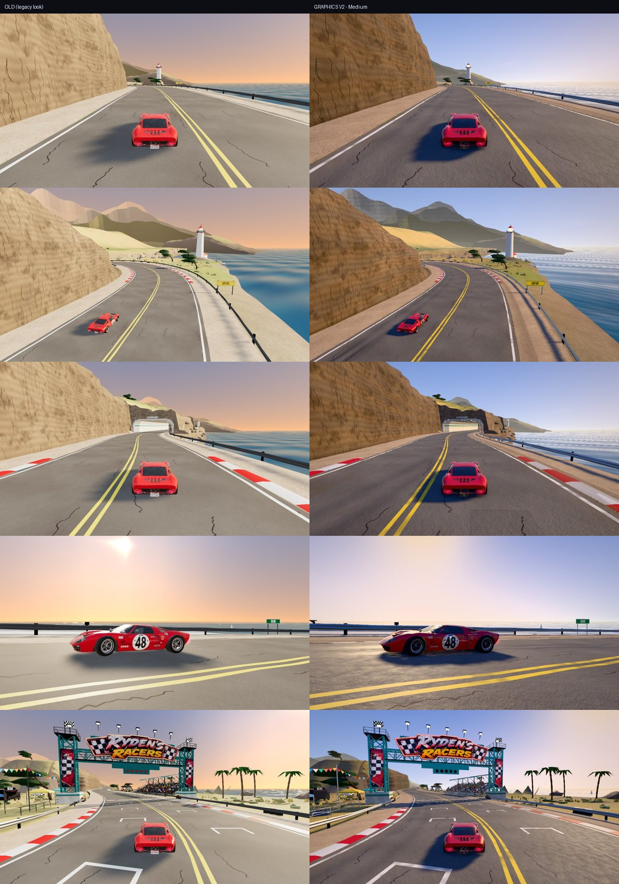
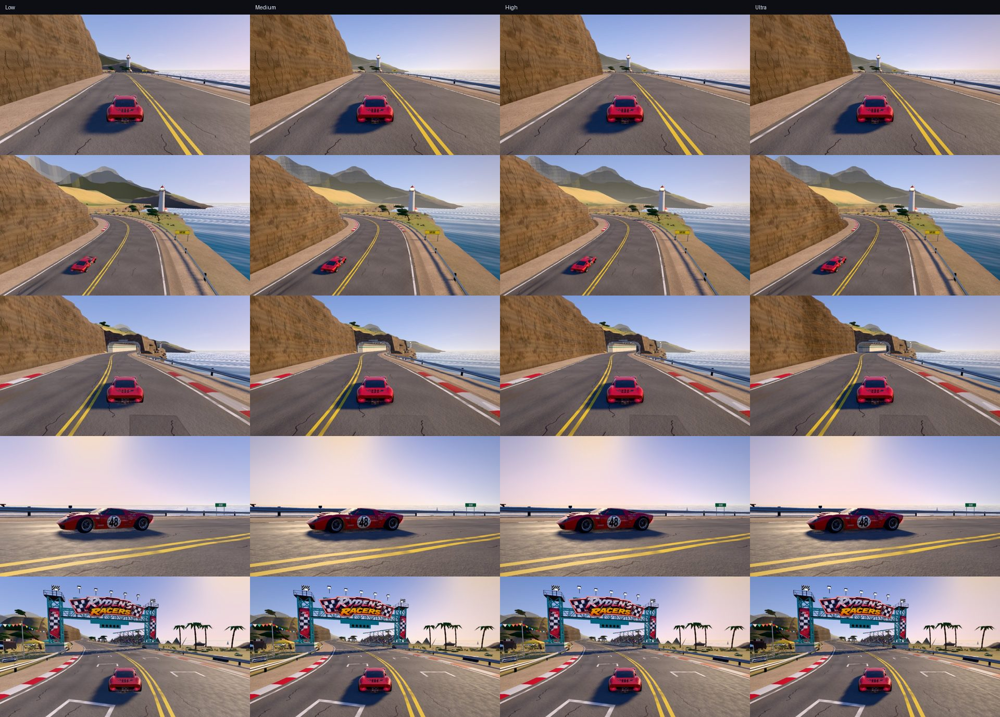

# Phase 2 · Pacifica Graphics V2 benchmark

Pacifica Cliffs is the first track with a Graphics V2 **look** (`LOOKS.coast` in `js/gfx/v2.js`). What
changed on screen, in the order it matters:

## 1. Colour pipeline

Colour management is on (sRGB hex colours are converted to linear light), light units are physical,
and the image is tone mapped with **Khronos PBR Neutral** in the post pipeline. Before, the game mixed
display-referred colours with ACES, which washed everything towards peach and pushed saturation in
the shadows. Now whites stay white, the road is grey rather than beige, and the ocean is blue rather
than cyan-grey. The look was tuned against the benchmark shots to stay *natural* (no teal/orange grade, no crushed blacks).

## 2. Lighting: a sky that actually lights the world

- **Sun**: warm white (`#ffe2bd`), physical intensity 3.7, raised from 19° to 27° elevation (same
  direction). The low old sun lit the road only at a grazing angle; now the road, cliff and car read as
  sunlit, and the shadows are long but not endless.
- **Sky light = image-based lighting**: the sky dome is rendered to a PMREM environment and used as
  `scene.environment` for every PBR material. The flat hemisphere light is off. Shadowed areas pick up
  blue sky light, surfaces facing the sun side pick up the warm glow, and metal and paint reflect the
  real sky and horizon.
- **Shadows**: a 2048² map covering ±55 m around the car (Medium), snapped to shadow-map texels in light
  space so the edges no longer crawl as the car moves. Soft PCF (radius 2.2) with retuned bias and
  normal bias. Only near objects cast shadows (see 13 · Performance).
- **Contact depth**: GTAO darkens contact points: tyres on asphalt, guardrail posts, curbs, the foot
  of the cliff, stalls and palms at the festival.

## 3. Sky and atmosphere

- A new analytic sky (`js/gfx/sky.js`): an air-mass horizon gradient, a golden Henyey–Greenstein glow
  around the sun that *replaces* the blue (no lavender halo), a limb-darkened HDR sun disk, light cloud
  cover, and a ground/sea lower hemisphere. The same function drives the IBL and the water reflections,
  so the sky, the lighting and the reflections always agree.
- **Aerial perspective**: height-based haze from the depth buffer. The headlands and the far coast fade
  into a warm haze by distance and altitude. That depth is the biggest difference in the wide shots.

## 4. Water

A new ocean shader: six directional wave layers (fading with distance to avoid shimmer), Fresnel
reflection of the sky, depth-tinted body colour, and a GGX sun-glitter path in HDR that the bloom picks up.

## 5. Materials

- **Road**: layered asphalt, rubbered-in racing line, edge wear, worn paint, decals (11 · Road).
- **Cliffs and rock**: macro colour variation, strata bands, a detail normal map, moss/scrub tint on flat tops.
- **Ground, concrete, stone**: macro variation and a detail normal map.
- **Metal** (guardrails, gantry, festival steel): metalness 0.85 / roughness 0.42 under the IBL, so they
  read as galvanised steel instead of grey plastic.
- **Glass, signage**: glossy glass; emissive signs slightly above 1.0, so they glow a little.
- **Parked festival cars**: clear-coat paint.
- **GT40**: 10 · GT40.

## 6. Environment depth (restrained, intentional)

Three Meshy assets, processed in Blender into game-ready LOD0/LOD1 props (08 · Assets), placed where
they have a reason to be:

- **Cliff overlook** (the lay-by at sample ~150): two picnic tables and two trash cans.
- **Festival paddock** behind the start: a Corvette Grand Sport on display, and a trash can.

The heavy Meshy plants (heather, red-hot poker) were **not** placed. They do not decimate below about
12k triangles each and need retopology or card impostors first.

## 7. Scenery zones and culling

The merged scenery meshes (grass, scrub, rocks, shore rocks, cypress, palms, guardrail, trackside,
crowd) are split into 40 spatial chunks. That lets frustum culling and the shadow camera work per
chunk. Near-zone chunks (grass, scrub) are hidden beyond ~460–700 m, mid-zone chunks (trees, trackside)
beyond ~1.3–1.6 km; cliffs, headlands and horizon are always drawn. Distances scale with `lodBias` per tier.

## 8. Optimised assets

On V2 the environment loads as `env_coast.v2.glb`: KTX2 textures (about 35 % less texture memory in the
benchmark's own estimate) and Meshopt geometry (a 9.2 MB download instead of 11.8 MB).

## Screenshots (same camera, same frame)

Left: OLD (Phase 1 look on r186, `?gfx=legacy`). Right: GRAPHICS V2, Medium. Images:
`docs/graphics-v2/img/phase2/`.

Tiers (Low · Medium · High · Ultra):

