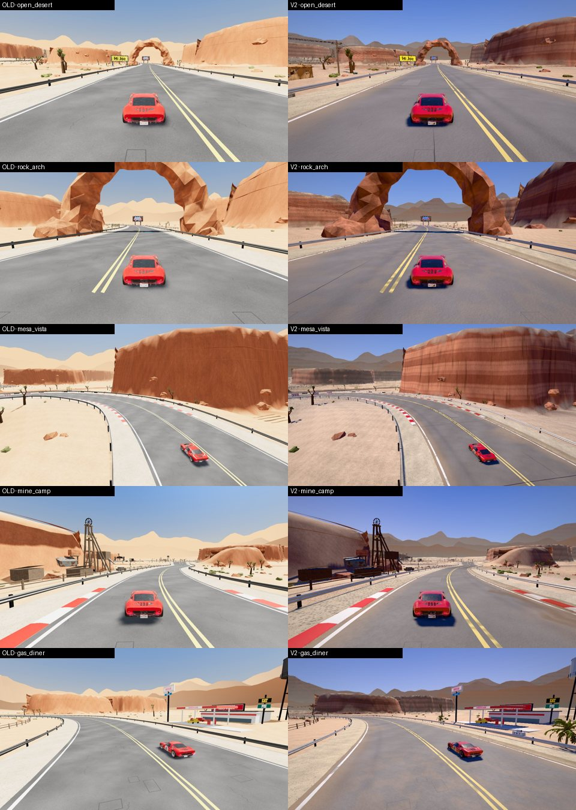

# Phase 3 · Mojave Mesa Run V2

Track id `mesa` (theme `desert`). Look: `LOOKS.mesa` in `js/gfx/v2.js`. Benchmark: `?bench=mojave`.
`?gfx=legacy` still shows the Phase 1 look (verified: same draw calls and triangles as before Phase 3).

## The identity: high desert noon, not an orange filter

Pacifica is a golden afternoon: low warm sun, soft haze, sea light. Mojave is the opposite, and every
value was chosen against that:

| | Pacifica | Mojave |
|---|---|---|
| Sun | low (elevation 0.46), golden `0xffe2bd`, 3.7 | **high (0.84)**, near white `0xfff4e4`, **4.3**: short, dense shadows |
| Sky | warm golden band over the sea | **deep cobalt zenith** `0x1c5cc6` to a **pale blue-white horizon**; the dust warmth is only the last few degrees (warm band `0xc9a27a`) |
| Clouds | 0.34 | 0.06 (almost none) |
| Haze | sea mist, warm | **low dust layer** (falloff 0.009: heavier near the ground), neutral-pale `0xcfccc4`: distant ranges go pale, not brown |
| IBL ground | brown-grey | **warm sand bounce** `0xc49e76`: shadows on the rock stay warm instead of turning purple |
| Grade | sat 1.08, warm white balance | sat 1.04, **neutral** white balance, a touch more contrast |

**Why it is not orange.** The legacy desert art (terrain vertex colours, rock textures) was authored for
the old unmanaged colour pipeline, where sRGB textures were shown without decoding and so came out pale.
Under correct colour management the same art turns saturated orange. The look re-balances it per
material instead of grading the whole frame:

- sand: desaturated to 34 % and lifted towards buff (`sand` detail shader),
- rock / strata: desaturated to 58–66 % and split into bands,
- scrub and Joshua leaves: grey-green (`color:[0.86,0.9,0.8]`), weathered wood greyed.

The warm colours that remain are where they belong: the rock bands, the sand, the horizon.

## Terrain and rock

The mesas next to the road are part of the same `terrain` mesh as the sand (material `m_ground`), exactly
like the legacy terrain colouring, so one shader does both by slope:

- **flat → sand**: wind ripples, dark *desert pavement* gravel patches with grit, pale bleached washes,
  slope darkening;
- **steep → banded sandstone** (`STRATA`): warped horizontal sediment bands (rust / rose / cream), *desert
  varnish* (dark vertical streaks down steep faces), a sand-dusted caprock on top.

The separate mesa meshes (`m_strata`) and rocks / the arch (`m_rock`, `desertRock`) use the same recipes.
The desert kinds run after the vertex colours (the legacy art multiplies orange vertex colours onto the
texture), Pacifica's kinds are unchanged.

## Road: sun-bleached Route 99

All in `js/gfx/road.js` / `decals.js`, switched on per look (defaults off, Pacifica unchanged):

| feature | what it does | look value |
|---|---|---|
| sun bleach | oxidised grey binder, fresher (darker) where the macro noise says so | `bleach 0.55`, `bleachColor 0x9d9892` |
| sand encroachment | tongues of sand from the edges into the lane, thin veils across it | `drift 0.85`, `edgeStart 0.7`, `dust 0xb89c78` |
| faded paint | chalky, sun-faded yellow and white, more wear | `lines {wear 0.62, fade 0.35}` |
| thermal cracks | tar-sealed transverse cracks across the full width, every ~26 m | `thermalEvery 26` (decal cell 12) |
| crack sealing | long tar snakes | `tarEvery 34` |
| repairs | sun-faded, lighter repair patches with sawn edges | `fadedPatchEvery 140` (cell 11) |
| sand drifts | wind-blown drifts off the shoulders | `driftEvery 70` (cell 10), tinted `gritTint 0xf0d6ae` |

## Environmental storytelling

Every placement has a reason, and every group is a small scene (`dressing` in the look):

| where | scene |
|---|---|
| open straight, left (i 57–74) | **Route 99 trading post / rest area**: adobe pueblo, two picnic tables, a bin, its generator; the **utility line** (procedural poles and sagging wires, `roadside`) runs along the old road to it |
| rock arch (i 121) | an **ibex** on the rocks, watching you go by |
| after the arch (i 186–198) | the **abandoned muscle car** that ended up against a **ranch fence** (procedural posts and wire), a burnt stump next to it |
| mine camp (i 620–640, left) | the miners' **rat rod**, their compressor, an ore bin (dumpster) |
| service station (i 906–934, right) | **ice freezer** at the front, the compressor at the side, the **delivery truck** parked up, a bin at the back, **two palms** someone keeps watering |
| everywhere | **desert bloom** (red-hot poker, instanced, impostor cards) in clusters, **burnt stumps** |

The existing env GLB already has Joshua trees, scrub, rocks, the diner, the mine, the festival; the new
pieces fill the roadside between them and give each place a story.

## Environment assets

- `env_mesa.v2.glb`: KTX2 (UASTC for signs, gantry, Maximus, asphalt; ETC1S for the rest) + Meshopt,
  14.2 MB → 10.1 MB. `?origassets` loads the original.
- 9 Mojave props from Meshy, processed with `tools/blender/rr_prop_pipeline.py` (see 18 · Vegetation and
  props, and the table in 08 · Asset optimization).

## Zones and draw calls

In the open desert almost every chunk is in view at once, so the zones use large cells (650–750 m: a few
chunks, not dozens) — small cells had added ~55 draw calls on the open straight. Distance and shadow
culling still apply (`scrub` 700 m / shadows 260 m, `rocks` 1100 / 300, `joshua` 1500 / 350).

## Benchmark scene `?bench=mojave` (GT40)

| shot | why | V2 Medium (container, SwiftShader) draws · tris |
|---|---|---|
| `open_desert` | open desert: bleached asphalt, faded paint, sand, mesas, haze | 155 · 472k |
| `rock_arch` | detailed rock close-up, arch shadow, road edge | 116 · 430k |
| `mesa_vista` | large vista from the mesa top | 86 · 349k |
| `mine_camp` | detailed area; **stress scene** (sees the mine, festival, diner, gantry, grandstand at once) | **202** · 450k |
| `gas_diner` | dense roadside: service station | 125 · 349k |
| `arch_run` | moving | 115 · 445k |

Real-device frame times: see 13 · Performance (to be filled from the device runs).
