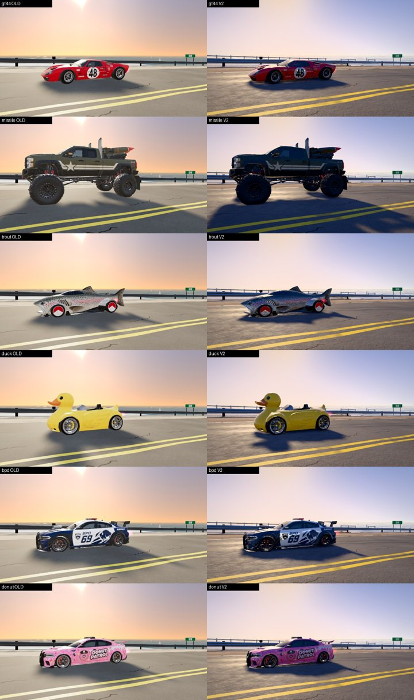

# Phase 3 · Vehicle material pipeline

Phase 2 shaded the GT40 from an auto-generated material-ID *mask* (a texture guessed from the atlas).
Phase 3 replaces that with **real material slots exported from Blender**, for six cars.



## The slots

| slot | what | V2 shading (defaults, `SLOT_DEFAULTS` in `js/gfx/vehicles.js`) |
|---|---|---|
| `car_paint` | body panels, livery (incl. black paint) | clear coat 1.0, roughness 0.42 (30 % of the atlas roughness kept) |
| `car_glass` | windscreen, windows, canopies | near-mirror (roughness 0.035), clear coat, darkened |
| `car_lights` | head/tail lamps, indicators | glossy lens + a little emission (0.35) |
| `car_chrome` | polished metal | metalness 1, roughness 0.12 |
| `car_rubber` | seals, bumper strips | roughness 0.9, no clear coat |
| `car_tire` | tyres | roughness 0.92, slightly darkened |
| `car_wheel` | rims, hubs, brakes | metalness 0.8, roughness 0.32 |
| `car_interior` | cockpit | matte, darker, no clear coat |
| `car_trim` | black plastic on the lower body (sills, grilles, diffusers) | roughness 0.6, light clear coat |
| `car_emissive` | police light bars | emission 2.6, alternating left/right flash |

Per-car overrides live in `PROFILES[id].slots` (e.g. Missile Commander: satin paint, gunmetal hardware;
Trout Protocol: metallic flake; the police cars: `police:true` for the flashing bar).

## Pipeline

```
models/cars/<car>.glb  (Meshy: one baked material)
   │  tools/blender/rr_car_slots.py   (Blender: classify every face into a slot; --debug false-colour render)
   ├─► build/<car>.slots.glb          editable Blender result (named materials) – fix faces by hand here
   └─► build/<car>.labels.json        slot of every triangle (+ sampled centroids)
   │  tools/car_apply_slots.mjs        (splits the ORIGINAL file's triangle lists by slot; vertex data untouched)
   ▼
models/cars/<car>.v2.glb            what the game loads on the V2 pipeline (GFX.assets.VARIANTS)
   │  GFX.vehicles.foldSlots() on load: the slots of each part fold back into ONE mesh with a per-vertex
   │  slot id (aSlot) and one material, so game.js sees exactly the structure it always did
   ▼
GFX.vehicles.slotMaterial()          on a V2 track: one physical material that shades each slot
```

**Why the extra step instead of shipping Blender's export.** The car's bounding box sizes its collision
box (`halfW`/`halfL` in the physics) and its wheel setup. A Blender import/export moves vertices by a few
floats; `car_apply_slots.mjs` keeps the original vertex buffers byte for byte and only regroups triangles,
after checking that Blender's face order matches (sampled centroids, error ~7e-6). Verified in the game:
L, W, H, wheel radius, wheel width and axle positions are **identical** to the originals for all six cars,
so handling and collisions cannot change.

**Draw calls do not go up.** Ten slots would be ten draws per part; folding them back gives one draw per
part (body + 4 wheels), the same as the original. The file sizes grow by ~2 KB (the extra index lists).

**Legacy is untouched.** `?gfx=legacy` (and r128) load the original GLBs. On V2 tracks without a look yet
the folded car renders with its original single material: same pixels as before.

## How faces are classified (automatic)

Per face, the atlas is sampled at the UV centroid and near the three corners (base colour + metal/
roughness), combined with where the face is on the car (height, front/rear, facing):

- **glass**: dark and glossy, in the upper half, within the cabin length (not spoilers/wings at the ends);
- **lights**: at the very front/rear, mid height, glossy, facing straight out, bright-neutral or strongly
  red/amber; a spatial cluster larger than 1.5 % of the body's surface is livery, not a lens (the Duck's
  yellow front), and goes back to paint;
- **chrome**: metallic, or mid-grey and very glossy (glossy **white** is paint: BPD 69 and Trout Protocol
  had white livery taken for chrome before this rule);
- **trim / rubber**: dark plastic only on the lower body: dark on the upper body is black paint (GT40);
- **interior**: faces inside the cabin that face inwards;
- **wheels**: tyre = dark and rough or on the outer disc; chrome = polished; the rest = rim;
- **light bar** (`--police`): roof, saturated red/blue;
- a majority filter removes single-face speckle.

## Results per car (be honest: what is automatic, what needs hands)

Share of faces per slot (from the reports), and a verdict from the false-colour check renders
(`docs/graphics-v2/img/phase3/car_slots_*.png`):

| car | paint | glass | lights | chrome | tyre | rim | interior | trim | light bar | verdict |
|---|---|---|---|---|---|---|---|---|---|---|
| GT40 (`gt44`) | 37.6 % | 1.0 % | 0.3 % | 0.1 % | 40 % | 16.3 % | 0.4 % | 4.2 % | – | **good as is** (windscreen, side glass, tail lamps, rims/tyres correct; covered headlamps stay paint) |
| Missile Commander | 54.9 % | 0.3 % | 0 % | 0.1 % | 24.9 % | 1.9 % | 10.5 % | 7.4 % | – | **usable**; very little glass found (small, dark windows), no lamps found: **hand pass recommended** for windows and lamps |
| Trout Protocol | 56.4 % | 2.6 % | 1.0 % | 0.6 % | 27.2 % | 8.4 % | 2.0 % | 1.9 % | – | **good** after the white-livery rule (canopy correct) |
| Duck Plasma | 27.4 % | 2.2 % | 0.2 % | 2.7 % | 27 % | 29.9 % | 5.7 % | 4.9 % | – | **good** after the lens-size rule (the yellow body stays paint; eye = glass, cockpit = interior); the beak tip glows faintly |
| BPD 69 | 41.7 % | 5.7 % | 0.2 % | 0.3 % | 22.5 % | 12.8 % | 3.3 % | 13.1 % | 0.3 % | **good**: light bar found and flashing, glass correct, wing = paint; trim share is high (lower body is black) |
| Donut Patrol | 49.5 % | 4.3 % | 0.4 % | 0.1 % | 16.4 % | 27.9 % | 0.4 % | 0.9 % | 0.1 % | **good**; light bar is small: **check by eye** in game |

## Remaining cars

| car | can be automated? | why |
|---|---|---|
| Hellcat, Night Leopard, Concordance, White Lightning, General Lee | **yes**: conventional car shapes (greenhouse glass, lamps at the ends, round wheels) — the same rules apply. Run the two tools, look at the debug render, ship |
| BRCC rotor (`rotor.glb`), FDC pickup (`rrpickup.glb`) | **partly**: the pickup bed and the rotor's exposed mechanics will be read as trim/chrome by guesswork; a quick hand pass (select faces → assign slot) is needed |
| The procedural cars (non-GLB bodies) | not applicable: they are built in code with their own materials, already V2-lit |

What automation cannot do: find glass or lamps that the atlas does not distinguish (the Missile
Commander's windows are painted into the body texture); separate an interior that Meshy never modelled;
fix a wrong face without a human looking at the check render. For those, open `build/<car>.slots.glb`
in Blender, select the faces, assign the slot, export labels again.
