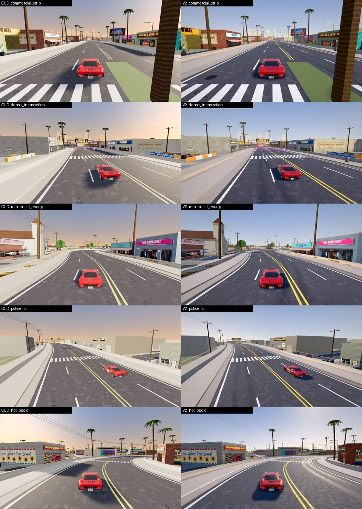

# Phase 4B · Alondra Blvd V2

Track id `alondra` (theme `city`). Look: `LOOKS.alondra` in `js/gfx/v2.js`. Benchmark: `?bench=alondra`.
`?gfx=legacy` shows the old look (unchanged).

## Identity: a smoggy Southern California afternoon

Not Pacifica's golden coast, not Mojave's hard noon. A mid-height, warm-neutral sun throws long building
shadows across the boulevard; the sky is a hazy mid-blue with a milky horizon; there is a lot of sky and
concrete bounce, so the street reads bright even in shade; shop windows are glossy; stucco is grimy.

| | value | why |
|---|---|---|
| tone mapping | Neutral, exposure 1.18 | concrete and stucco stay neutral; no ACES orange shift |
| sun | `0xfff0de`, 3.8, elevation ~37° | long shadows across a four-lane road |
| sky | zenith `0x3f78c2` → horizon `0xd6d8d6`, mie 0.85 | smog, not a clean desert sky |
| haze | density 0.0011, warm grey `0xd3ccbe` | the downtown skyline fades, the next block does not |
| IBL | 0.88 + hemisphere 0.12 | bright shade under awnings |
| grade | sat 1.05, contrast 1.06 | signage colours pop without the stucco going pastel |

## Materials

**The black-wall bug (fixed).** The Alondra env has **no vertex normals** (281 of 292 primitives, flat
shaded). The V2 detail shaders read the world normal (`vDN`), which was `normalize(0)` = NaN, and every
building rendered black. The detail shader now derives the face normal from screen derivatives when the
vertex normal is missing (`cross(dFdx(vDW), dFdy(vDW))`). The same fix applies to Revolution (all 360
primitives lack normals). `?nodetail=1` switches the detail shaders off for A/B checks.

| material | V2 treatment |
|---|---|
| `m_stucco` | fine grain, **street-level grime** (darker in the first 1.5 m above the kerb), water stains streaking down |
| `m_brick`, `m_block` | macro variation per brick course, base grime |
| `m_facade` (shop fronts) | the dark, low-saturation window areas of the atlas become **glass**: roughness 0.06, reflect sky and street |
| `m_glass` | near-mirror, env intensity 1.6 |
| `m_metal`, `m_steel` | roll-up doors, awnings, poles: metalness 0.65–0.8 |
| `m_concrete` | the stone detail (sidewalks, kerbs, barriers) |
| road `m_road` / `ab_road` | the V2 asphalt: rubber line 0.3, city dust, albedo 1.15 |

## Road and wall decals

Road decal cells (all on the real road surface, one draw): patches, tar snakes, cracks, **manholes**
(every ~52 m), **patched potholes** (~115 m), **oil drips** in the lanes (~34 m).

**Wall art** (new, `GFX.decals.buildWalls`): rays from the kerb find walls facing the road; quads from a
2048×1024 atlas (throw-ups and tags with invented words, painted ads — CAR WASH, TIRES, TACOS, MUFFLERS,
CHECKS CASHED, PHONE REPAIR — posters, BPD / NO PARKING / TOW AWAY / LOADING stencils) are placed 4 cm off
the wall. One merged mesh, one draw; 46 quads on Medium (scaled by the prop-density preset).

## Street life: dressing and instanced props

Nothing is on the racing surface: everything is at the kerb line or beyond, decorative only (no collision).

| scene | where (sample, side) | assets |
|---|---|---|
| **BPD precinct lot** | 312–321, right, angled nose-in | 3 × `ab_police_cruiser`, `ab_donut_cruiser` |
| **traffic stop** | 110–113, left, in the lot at the big intersection | a cruiser behind the pulled-over `mz_muscle_sedan` |
| Donut Patrol on its break | 96, right | `ab_donut_cruiser` |
| parked cars | lots and driveways (147, 229, 240, 258, 441, 465, 468, 588, 600) | muscle sedan, Corvette, rat rod |
| delivery | 426, right | `mz_panel_truck` unloading |
| service alleys | 96, 144, 411, 462, 504 | `mz_dumpster` |
| sidewalk bins | commercial strip and Hot Block; wheelie bins on the residential kerbs | `pc_trash_can` |
| ATMs | four storefronts | `ab_atm` |
| rooftop AC | nine flat commercial roofs (probed from above) | `ab_ac_unit` |
| front yards | south side (140–285) and around the park (540–640) | `ab_red_lily` (351 impostor cards), `pc_banana` (33) |

The yard spots are not guesses: a probe (`test/free.js`) cast rays along the whole track and kept only
points on ground/concrete at street level with ≥ 4 m clearance in 8 directions. 344 instances, 29 draws.

`ab_graffiti_wall` (a free-standing mural wall) was tried and **removed**: its rebaked texture reads as a
dark smear at street distance. The wall-art decals on the real walls do that job.

## Draw calls: merge by material

The env is split into neighbourhood objects (`ab_n_*`, `ab_f_*`, `ab_street_*`...), each with up to 18
materials, and the neighbourhoods share the same materials: **~280 draws** before any V2 work. Zones did
not help (every neighbourhood is in view) and chunking them made it worse (1071 chunks, 585 draws).

`GFX.lod.mergeByMaterial` merges static meshes that share a material (and shadow flags) into one mesh per
material per 350 m cell; the cells keep frustum culling useful. Shading is identical (same materials, UVs,
colours), verified on the benchmark shots.

| shot (Medium, container counters) | before merge | after | legacy |
|---|---|---|---|
| commercial strip | 289 | **222** | see 24 |
| dense intersection | 236 | **191** | |
| residential sweep | 287 | **203** | |
| police lot | 305 | **205** | |
| Hot Block | 371 | **257** | |
| boulevard run (moving) | 230 | **177** | |

## Assets

`env_alondra.v2.glb`: KTX2 (UASTC for signs, shop fronts, gantry, asphalt; ETC1S for murals, tags, event,
walls and the rest) + Meshopt, **16.2 MB → 11.8 MB**; texture memory of the whole scene (`GFX.materials.stats`, transcoded sizes)
**259 MB → 134 MB** at the commercial strip shot. `?origassets` loads the original.

## Benchmark `?bench=alondra` (GT40)

| shot | why |
|---|---|
| `commercial_strip` | storefronts, glass, signs, sidewalks, wall art, boulevard asphalt |
| `dense_intersection` | cross street, crossing, traffic stop, the most buildings in view |
| `residential_sweep` | houses, yards, fences, trees, utility line |
| `police_lot` | BPD / Donut Patrol presence |
| `hot_block` | **stress scene**: murals, lit signs, tags, dense storefronts, most draws |
| `boulevard_run` | moving |

Frame times: see `24-phase4-performance.md`.
