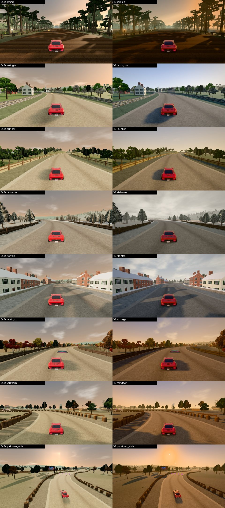

# Phase 4C · Revolution V2 ("Y'all Fuck With Racin?")

Track id `revolution` (account track). Look: `LOOKS.revolution` in `js/gfx/v2.js`. Benchmark:
`?bench=revolution` (needs a signed-in account, like the track itself: the benchmark waits for access and
never bypasses it). `?gfx=legacy` shows the old look.

## Built on the course's own chapter system

The course already has seven chapters (`TRACK_DATA.revolution.chapters`), a chapter lookup
(`revChapterAt`, with a 70-sample blend before each chapter) and a legacy atmosphere updater (`REV_ATMO`).
V2 does not replace any of that. `V2.chapterLooks()` derives one full look per chapter from the base look
plus the chapter's overrides and registers an updater that runs **after** the course's own, so it has the
last word on the lights:

- per frame: find the chapter blend at the player (in a benchmark: at the posed car), interpolate sun
  colour and intensity, sky (zenith, horizon, warm band, ground, clouds, mie, horizon power), haze (density,
  falloff, colour, sun colour), grade (saturation, contrast, white balance, lift), bloom, exposure and fog;
- the **IBL** cannot be interpolated cheaply, so one PMREM per chapter is baked at load (7) and the scene
  environment switches at the blend midpoint, when the two chapters' lights are equal parts. No PMREM work
  while racing;
- the **sun direction is fixed** for the whole course (low, from the south-west): shadows never swing;
- the chapter fog keeps the **legacy chapter distances** because the course culls its vegetation and
  building tiles by the fog distance: the same tiles are in view as before; the V2 haze does the aerial
  perspective.

The Meshy palisade (`rv_palisade`) was tried at the Bunker Hill redoubt and the Yorktown siege works but
did not read from the road behind the course's barriers, so it is not placed.

Kept from the course: the swamp / river / harbour water shaders (the V2 ocean is not applied: a look
without `ocean` never replaces water), the two-scale ground shader, road wear, leaf wind, troops, smoke,
muzzle flashes, artillery arcs, portals, flags, ice floes.

## The chapters

| chapter | mood | key values |
|---|---|---|
| **The Swamp Fox** (drag strip start) | humid, low golden sun through green-grey mist | sun `0xffb574` 2.7, haze 0.0034 green-grey, IBL 0.72 |
| **Lexington & Concord** 1775 | crisp, clear spring morning | sun near white 3.7, deep blue sky, light haze |
| **Bunker Hill** 1775 | hot afternoon, dust and powder smoke | warm haze `0xe0d2b2`, contrast 1.07 |
| **Crossing the Delaware** 1776 | overcast winter dusk: **grey and cold, not blue** | sky `0x8a94a0` → `0xdcdbd6` (grey, not cyan), clouds 0.8, sun `0xf2ebe0` 1.9, **white balance pulled warm** `[1.03,1,0.955]`, saturation 0.9 |
| **Trenton** 1776 | the morning after: low winter sun on fresh snow | sun `0xffe6c8` 2.8, pale sky, warm WB |
| **Saratoga** 1777 | golden autumn woods | sun `0xffcc8a`, saturation 1.09 |
| **Yorktown** 1781 | the payoff: grand late-afternoon gold | sun `0xffc27c` 3.8, exposure 1.1, bloom 0.075 |

**Why Delaware is not blue.** The legacy chapter already had a blue-grey fog (`0xc6d0dc`) and a blue sky;
under the V2 tone mapper a cool sky + cool IBL + snow turns everything cyan. The V2 values keep the sky and
the haze neutral grey, push the white balance slightly warm and cut saturation, so snow reads white, the
river slate-grey, and the cold comes from the low contrast and the flat light, not from a tint.

## Materials

The env has no vertex normals (flat shaded, like Alondra): the detail shaders use the derivative normal.

| material | V2 |
|---|---|
| `m_stone`, `m_stonewall` | stone detail (Lexington walls, Trenton kerbs) |
| `m_earth` | ground detail (redoubts, earthworks) |
| `m_facade` | colonial facades: dark window panes read as glass |
| `m_snow` | roughness 0.62, env 1.15: wind-packed sheen, not white plastic |
| `m_iron` | cannon, hardware: metalness 0.7 |
| `m_timber`, `m_planks`, `m_wicker`, `m_bark`, `m_canvas`, `m_sandbag`, `m_shingle` | rough, matte |
| `m_ground`, `m_road`, `m_foliage` | **untouched**: the course's own shaders (dirt, mud, cobble and snow roads come from its textures and vertex colours) |

## Battlefield readability, troops

- Smoke (`RevPuffs`) and muzzle flashes are the course's; under V2 the flashes are bright enough to bloom
  (bloom threshold 1.5), the smoke is not (it stays a soft grey against the sky).
- Troops are already instanced with three distance tiers (near / mid / far) and **only the near tier casts
  shadows** (course code). V2 adds nothing per troop.

## Assets

`env_revolution.v2.glb`: KTX2 (UASTC signs and facades, ETC1S the rest) + Meshopt: **24.0 MB → 14.4 MB**.
The `rv_layout` extras (the course layout: portals, cannon arcs, troops) survive the conversion byte for byte;
the terrain height grid reads quantized positions correctly (`revHeightGrid` de-normalizes).

## Benchmark `?bench=revolution` (GT40)

Shots are placed relative to the chapter starts (`{ch:'delaware', off:35}`), so they stay valid if the
layout changes.

Container counters (SwiftShader, Medium, 40 measured frames so the course's 0.25 s tile cull has settled;
draws include shadow and post passes):

| shot | why | legacy draws · tris | V2 draws · tris |
|---|---|---|---|
| `swamp` | drag strip start: mist, swamp water | 223 · 643k | 232 · 624k |
| `lexington` | village, stone walls, militia | 131 · 414k | 161 · 637k |
| `bunker` | redoubt, smoke, flashes | 116 · 565k | 141 · 655k |
| `delaware` | winter dusk, ice, snow | 156 · 582k | 179 · 606k |
| `trenton` | snow in low sun, town | 170 · 500k | 186 · 539k |
| `saratoga` | autumn woods | 176 · 713k | 215 · 849k |
| `yorktown` | siege lines, artillery | 142 · 757k | 172 · 978k |
| `yorktown_wide` | **stress scene**: most troops, smoke and structures | 320 · 798k | **412 · 1.03M** |
| `chapter_blend_run` | moving through the Bunker Hill → Delaware blend | 156 · 518k | 176 · 535k |

The legacy column is **optimistic, and the gap is an artefact of the benchmark, not V2 cost**: in a
benchmark the course's own atmosphere updater takes the chapter from the race start (the race never runs),
so legacy culls every shot at the swamp's 600 m fog distance. V2 follows the posed car and uses the right
chapter distance (Yorktown 1300 m). Counting visible meshes at the same pose confirms it: vegetation tiles
134 (V2) vs 77 (legacy), building tiles 31 vs 23; everything else identical. In a real race both pipelines
use the player's chapter, so the V2 column is the realistic one for both. A real-GPU run is still to do
(account track, see 24).
