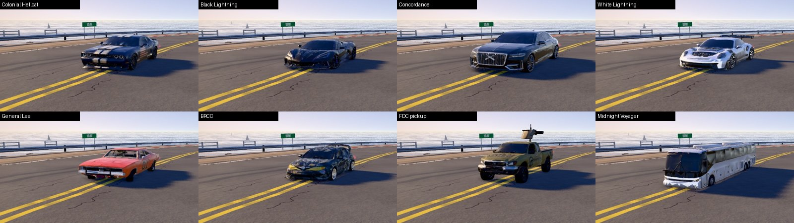
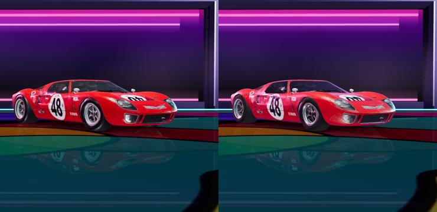

# Phase 4D/E · Vehicle material pass (all 14 GLB cars) and the showroom

Phase 3 gave six cars real material slots (`17-vehicle-pipeline.md`). Phase 4 ran the same pipeline on the
remaining eight, gave each a profile of its own, and moved the showroom to the same materials.

## Geometry parity (the part that must not change)

`test/cardims.js` builds every car with `buildCarModel()` on both pipelines and compares the model
dimensions (L, W, H, wheel radius / width, ride height), every wheel position and the bounding box:

| | result |
|---|---|
| all 14 GLB cars (6 from Phase 3 + 8 new) | **identical** on V2 and legacy: dims, wheel positions, bounding box (max difference 0.0000 m) |

`tools/car_apply_slots.mjs` keeps the original vertex buffers byte for byte and only regroups triangles, so
handling and collisions cannot change. `GFX.vehicles.foldSlots` folds the slots back to one mesh per part:
draw calls per car do not change.

## Per-car finish (`PROFILES` in `js/gfx/vehicles.js`)

| car | finish | slot classification (automatic) | verdict |
|---|---|---|---|
| Colonial Hellcat | deep navy **metallic**, show-car clear coat, hot headlamps | metallic navy read as chrome (34 %) and dark lower panels as trim (29 %) | **compensated**: chrome and trim slots are shaded as the same metallic paint; rims keep the atlas colour. Hand pass recommended (rims → `car_wheel`) |
| Black Lightning (leopard) | satin-wrap vinyl | black gloss upper panels read as glass | **compensated**: the glass slot is softened (roughness 0.14, 62 % atlas colour) so the hood never turns into a mirror. Hand pass for the real windows recommended |
| Concordance | silk-black limousine, mirror-deep clear coat, polished chrome, gold crests | black upper body read as glass | **compensated** (glass keeps 70 % of the atlas colour, gloss 0.06): paint and glass read alike, which on a black limo is correct |
| White Lightning | pearl white with a touch of flake, carbon trim, race lamps | pearl white read as chrome over half the body | **compensated**: chrome shaded as the same pearl paint |
| General Lee | 1969 solid orange enamel (softer than modern clear), chrome bumpers | paint, glass, interior, lamps, wheels all correct | **good as is** |
| BRCC rally hatch | black-and-gold camo wrap (matte), gold wheels | black camo patches read as glass | **compensated** (glass softened towards the wrap) |
| Firearms Direct Club pickup | sand-tan bedliner-textured paint, rough rubber, dull steel | paint, windows, trim correct | **good as is** |
| **Midnight Voyager (Bus V2)** | fleet-white coach paint under a clear coat, big tinted side glass (tint 0.2), bright lamp clusters (emission 0.7) | body, the whole window band, lamps and all six wheels correct | **good as is**. Stats and handling unchanged (speed 9 / accel 7 / handling 7 / drift 6 / weight 8) |

Check renders (false colour per slot) are in `img/phase4/car_slots_*.png`.

**Lesson for the classifier.** Its rules separate glass from paint by "dark and glossy in the cabin band" and
chrome from paint by "metallic or very glossy grey". Both fail on dark metallic, black gloss and pearl
paint, which are exactly the premium finishes. The profiles compensate in shading; a real fix is a hand
pass in Blender (`build/<car>.slots.glb`: select faces, assign the slot, `--keep-slots` to write labels) or a
colour-picked paint reference per car passed to the classifier.

## Showroom (menu and car select): tested, left opt-in

The showroom builds the cars with `buildCarModel()`. A hook (`GFX.vehicles.showroom`) can give them the same
slot materials as on the track, lit by the room's softbox env map. **Result: not better yet**, so it is
opt-in (`?showroomv2=1`) and the default showroom is unchanged:

Left: default. Right: slot materials. The showroom is still an **unmanaged legacy scene** (no colour
management, no post chain, lights tuned by eye for r128). There, the physical slot materials read darker, the
clear coat picks up a pink cast from the room strips, and the chrome rims go dark because the room env has
almost nothing bright for them to reflect. Raising the env intensity (tried: ×1.8) barely changes it.
The right fix is to move the showroom onto the V2 path (colour-managed output, Neutral tone mapping, the
bloom pass for the neon strips, a softbox env authored for physical materials) and then enable the slots:
a Phase 5 item (see 25).
