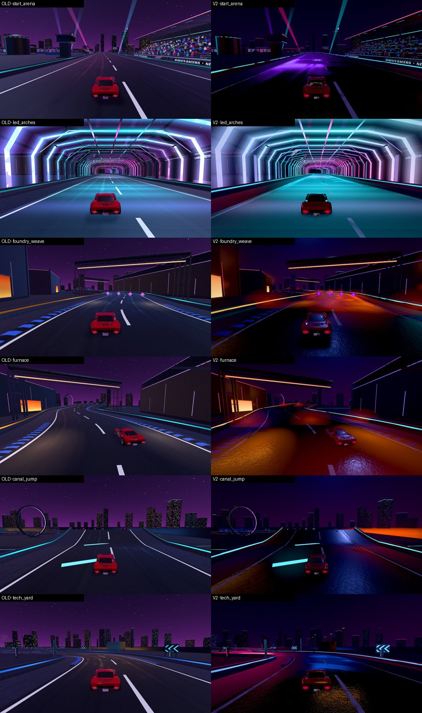
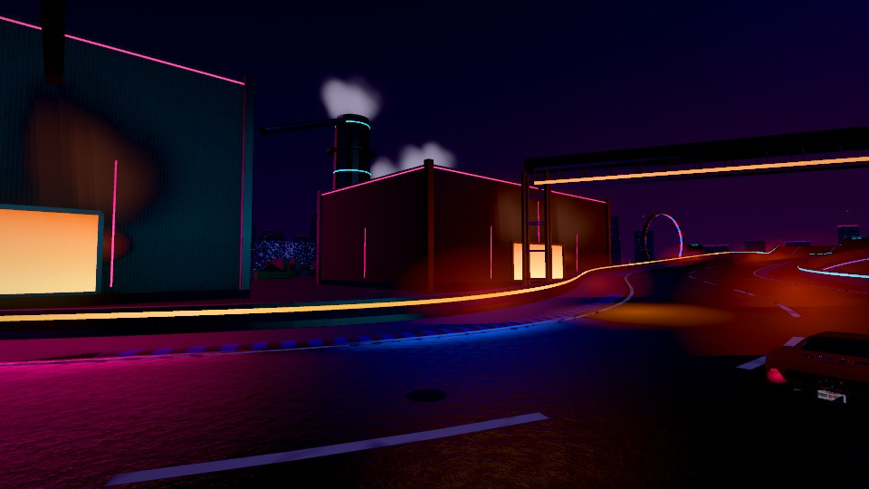

# Phase 5B · Neon Foundry Nights V2

Track id `neon` (theme `night`). Look: `LOOKS.neon` in `js/gfx/v2.js`, night effects in `js/gfx/nightfx.js`,
wet road in `js/gfx/road.js`. Benchmark: `?bench=neon`. `?gfx=legacy` still shows the old look.

## Identity: wet midnight in the steelworks

The old look was a flat purple night: every surface lit the same, a matte grey-purple road, LEDs as flat
paint. V2 keeps everything that makes the track recognisable (the LED arch tunnel, the route-guidance
chase lights, the chevrons, the furnace mouths, the skyline, the sky beams, the stands) and changes the
light around it:

| | value | why |
|---|---|---|
| exposure / tone mapping | 1.3, Neutral | deep blacks without crushing the road |
| sky | zenith `0x03040b` → horizon `0x1c1130`, warm band `0x3a1c10` | a black sky with magenta light pollution and furnace orange low down, not a purple gradient |
| moon (the only shadow light) | `0x8fa4ff`, 0.45, from the north-east | cars and barriers stay grounded; no fake daylight |
| fill | hemisphere 0.05 | shadows are dark; the neon does the lighting |
| haze | 0.0017, dark violet | the far skyline sinks into the night |
| bloom | threshold 0.85, knee 0.45, intensity 0.3 | only the LEDs, lamps and furnace go over the threshold |
| grade | contrast 1.12, a slightly cool white balance, lift 0.005 | contrast, but the road edge stays readable |

## Lighting without lights

No point lights were added (budget: zero). The layers are:

1. **The course's LEDs in HDR.** The LED materials are `toneMapped:false` basics and shaders written for a
   0..1 output. Under the V2 HDR chain they would read as flat paint, so the look multiplies them into HDR
   (basics ×1.6, shaders ×1.3; additive halos and the old fake road reflection ×0.5 because the wet road now
   reflects for real). Text signage (`m_signs`, gantry, title) is kept at 0.8 emissive, **under** the bloom
   threshold: it glows, it does not smear.
2. **A night IBL for reflections** (`GFX.nightfx.nightIBL`): a PMREM of a dark scene with HDR panels
   around the horizon: cyan, magenta and violet neon, a blue strip, sodium lamps overhead, a furnace-orange
   panel, a dim sky. Wet asphalt, car paint, glass and steel reflect coloured light instead of a black sky.
   The course's legacy env map is removed from the env materials so they use it (water keeps its own).
3. **Furnace glow cards** (`GFX.nightfx.glowCards`): 28 soft additive cards over the furnace mouths and
   pools (found by clustering the furnace meshes' vertices): local heat haze, one draw each, no lights.
4. **Moonlight** for shadows only.

## Wet road

`GFX.road.upgradeAsphalt` has a new wet mode (`road.wet` in the look; other tracks are unchanged):

- a thin **film** everywhere (35 % wetness), darker albedo where wet;
- **puddles** in the dips (two-scale noise), near-mirror roughness 0.07;
- **edge water** along the camber;
- **water streaks** running across the lanes;
- the **racing line is squeegeed drier** by the tyres (the rubber lanes lose 30 % wetness);
- road decals: oil drips every 24 m, tar, cracks, manholes.

It is not one perfect mirror: the roughness varies from 0.07 (puddles) to ~0.6 (the dry line), so the neon
reflections break up into streaks and pools.

## Steam and smoke

`GFX.nightfx.steam`: one `THREE.Points` for all emitters, CPU-updated, capped at `360 × particles`
(Medium 288, Low 180). 19 emitters: the stack tops (found by clustering `nf_stack_rings`) and the furnace
roofs (darker, warmer). Emitters beyond 560 m stop spawning, beyond 240 m they spawn at 40 %: distant
smoke thins out instead of costing. The plumes are pre-simulated for 8 s so they are already standing
when the race starts.

## Rain: investigated, not added

A rain layer would reinforce the wet road, but on this track it costs readability exactly where the
brief asks for it (the LED tunnel and the chicane). The road is already wet; rain is left as an optional
Phase 6 item (a screen-space streak layer with a per-preset switch, off on mobile).

## Readability

- the barrier route LEDs and the chevrons are the brightest things in view (they are HDR);
- lane lines keep their V2 paint shader; the road is never darker than the verges (lift 0.005);
- the fake arch reflection was reduced so the tunnel floor does not turn into a flat cyan sheet (checked on
  the benchmark shots).

## Asset

`env_neon.v2.glb`: KTX2 (UASTC signs, gantry atlas, Maximus, the MvM title, wet asphalt; ETC1S the rest) +
Meshopt, **8.7 MB → 6.7 MB**.

## Benchmark `?bench=neon` (GT40)

| shot | why | legacy draws · tris | V2 draws · tris (container, Medium) |
|---|---|---|---|
| `start_arena` | grandstands, gantry, event LEDs, wet grid | 111 · 180k | 121 · 189k |
| `led_arches` | **stress scene**: heaviest emissive + wet reflections | 83 · 159k | 123 · 169k |
| `foundry_weave` | dense industrial | 85 · 139k | 120 · 149k |
| `furnace` | furnace glow, heat, smoke | 77 · 139k | 104 · 148k |
| `canal_jump` | harbour / canal | 65 · 138k | 80 · 148k |
| `tech_yard` | service buildings, chicane | 70 · 134k | 84 · 144k |
| `arch_run` | moving | 71 · 157k | 98 · 167k |

V2 adds ~12 post passes, the glow cards, the steam and the decals; it is still the lightest track in the
game by far. Real-GPU numbers: `31-phase5-report.md`.

Full 8-car race on Neon V2 (with the new env): all finish, no errors.
