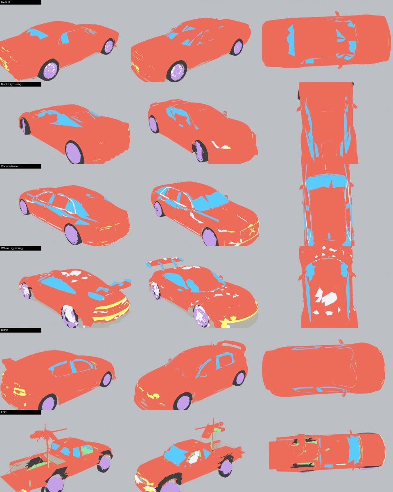

# Phase 5E · Source fixes for the problem cars

Phase 4 left five cars (Hellcat, Black Lightning, Concordance, White Lightning, BRCC) with wrong material
slots and **compensated in shading**: chrome and trim shaded as paint, glass softened towards paint. Phase 5
fixes the slot assignment itself and removes those compensations from `PROFILES` in
`js/gfx/vehicles.js`.



## Two real bugs, found on the way

1. **Hellcat, BRCC and FDC are rotated by the game** (`GLB_ROT` in `game.js`: their GLBs are long along
   X). The classifier assumed every car's front is glTF +Z, so for these three "front/rear" was really
   "left/right": lamps were looked for on the doors, the cabin band was across the car, and wheels were
   not found at all. `rr_car_slots.py --rot 90` now classifies in the game's frame.
2. **Their wheels are part of the body mesh** (no `wheel_*` nodes), so the wheel rules never ran: tyres
   and rims were paint or trim. FDC was affected too, although it was not on the list.

## Recipes: a reviewable hand pass

A hand pass in the Blender GUI cannot be reproduced or reviewed, and it is lost the moment the pipeline
runs again. Instead, each car has a small recipe in `tools/blender/slot_recipes/<car>.json`: ordered rules
that re-assign faces after the automatic classification, using the face's position in the car
(`nx`, `ny`, `nf`), its facing (`nz`, `nside`), its atlas colour (`lum`, `sat`, `mx`, `hue`), metal and
roughness, and, for cars with baked-in wheels, a wheel zone (axle positions measured from the tyre contact
patches, a radius, `wrad` = distance from the axle / radius). Each recipe has a `why`.

```
python3 tools/blender/rr_car_slots.py models/cars/hellcat.glb models/cars/hellcat_base.jpg models/cars/hellcat_mr.jpg \
        build/hellcat.slots.glb --rot 90 --recipe tools/blender/slot_recipes/hellcat.json \
        --labels build/hellcat.labels.json --debug build/car_slots_hellcat.png
node tools/car_apply_slots.mjs models/cars/hellcat.glb build/hellcat.labels.json models/cars/hellcat.v2.glb
```

| car | problem | recipe | result (share of faces) |
|---|---|---|---|
| **Colonial Hellcat** | rotated; metallic navy read as chrome (34 %), dark lower panels as trim (29 %); wheels in the body | `--rot 90`; wheel discs at nf 0.62 / −0.564, r 0.25 H (tyre = outer 30 %, rim inside); glass = dark, non-metal, cabin band; other chrome/trim = paint, sills stay trim | paint 41 %, tyre 24 %, rim 25 %, trim 6 %, chrome 1.5 %, glass 0.5 % |
| **Black Lightning** | black, non-metal, equally glossy everywhere: colour cannot separate glass from paint | geometry only: glass kept in the side-window, windscreen and rear-window shapes; any other "glass" is paint | glass 9.1 % → 1.3 % of all faces |
| **Concordance** | black gloss paint read as glass | same window-shape rule (limo proportions) | glass 3.3 %, chrome 3.4 % (grille, trim) |
| **White Lightning** | pearl white is metallic in the atlas → chrome over half the body; black livery stripes → glass/trim | light metallic = paint; dark metallic in the window shapes = glass; dark on the upper body = paint (stripes); carbon trim only on the lower body | paint 55 %, chrome 13 % (real: wheels, grille), trim 22 % (splitter, sills, diffuser), glass 2 % |
| **BRCC** | rotated; gold camo read as chrome, black camo as glass; wheels in the body | `--rot 90`; wheel discs; glass = dark + cabin band only; rest paint | paint 40 %, tyre 23 %, rim 28 %, glass 3 % |
| FDC pickup (bonus) | rotated; wheels in the body read as trim | `--rot 90`; wheel discs | tyre 11 %, rim 15 % (were 0) |

**Geometry parity** (the part that must not change): all 14 cars rebuilt and compared with
`test/cardims.js`: dimensions, wheel positions and bounding boxes identical to legacy (0.0000 m).

## What is still imperfect

- **Hellcat's windows** are only partly glass: in its atlas the windows are almost the colour of the navy
  paint. They read correctly in the showroom and on track (dark, glossy), but a painted mask would be
  cleaner.
- Recipes are rules, not a brush: a few isolated faces still land in the wrong slot (visible as specks in the
  check renders). They are not visible at game distances.
