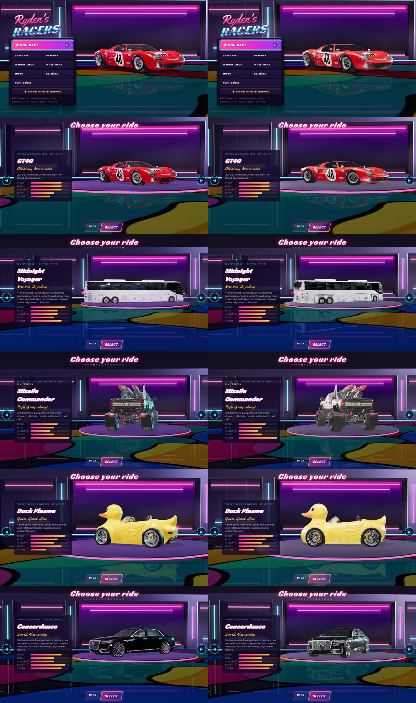
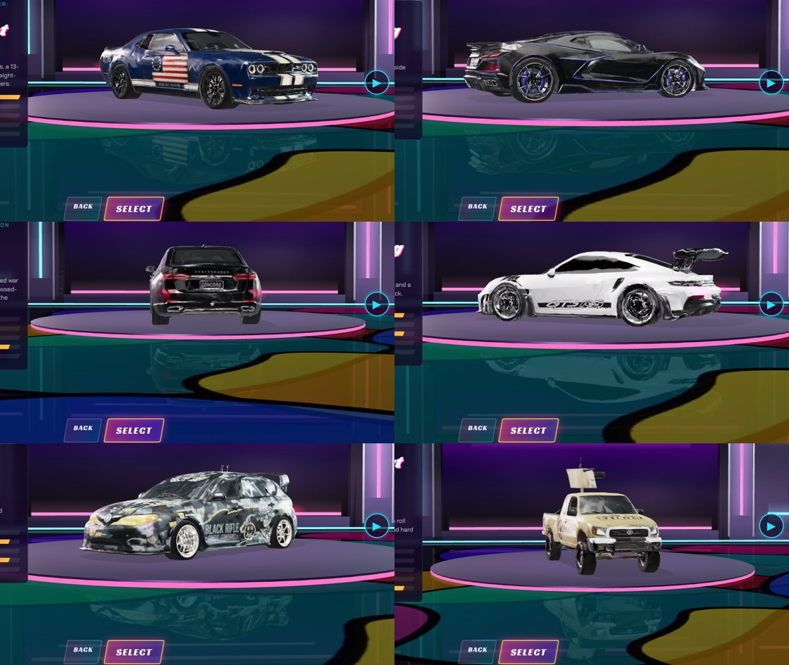

# Phase 5D · Showroom Graphics V2

`js/gfx/showroom.js`, hooked from the `Garage` constructor in `game.js`. Graphics V2 pipeline only;
legacy (`?gfx=legacy`, r128) never runs it. `?showroomv2=0` shows the old showroom on V2 for comparison.

Left: the old showroom (single-material cars). Right: V2 (slot materials in the new rig). Top to bottom:
menu showcase, GT40, Ryden's Bus, Missile Commander, Duck Plasma, Concordance.

## Why Phase 4's attempt looked worse

The slot materials are physical: clear coat, polished chrome, mirror glass. Their look is made of what
they reflect. The old room had a small softbox and saturated pink / cyan strips, so the paint went dark,
the rims went black, and every clear coat picked up pink.

## The rig

| | old | V2 |
|---|---|---|
| environment map | small overhead box, saturated pink and cyan strips | **studio env**: 16×7 m overhead softbox (HDR ×2.4) for the long highlight along roof and bonnet, two tall side strips (×1.5) for the lines down the flanks, a front fill, a grey back-wall glow and floor bounce; the pink / cyan accents are thin and dim (×0.9) |
| rim spots | saturated pink / cyan | 75 % towards neutral (`0xf2f0ff`), −15 % intensity: separation, not colour |
| hemisphere fill | purple | neutral grey |
| key light | as before | softer penumbra (0.9), softer shadow |
| car materials | the original single material | the track's slot materials (`GFX.vehicles.apply`) with the studio env |
| turntable | fixed 3.6 m disc | sized to the car (never smaller): the Bus stands on a disc that fits it |

The room itself (neon bars, cove, glossy floor with the mirrored scene under it, contact shadows) is
unchanged: the brand colours stay in the architecture, the car is lit neutrally.

## Framing

`Garage.frameCar` already fits each car's silhouette (the bounding circle of its turntable sweep) into the
stage of the current screen, so the Bus is framed as a bus (it fills the stage at its own scale; the camera
moves back instead of cropping it). Checked on GT40, Bus, Missile Commander, Duck Plasma and Concordance;
no change needed.

## The five fixed cars in the new showroom

## Not done

- The showroom is still an unmanaged scene (ACES direct, no post chain). The materials now read well
  there; moving it to the full V2 post path (bloom on the neon, GTAO contact shading) is optional polish.
