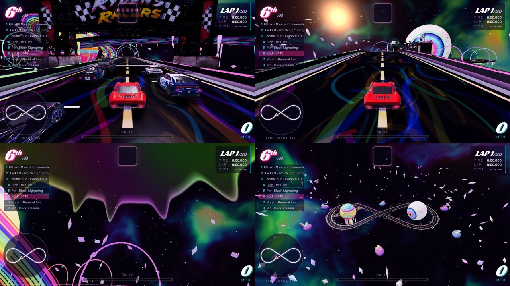

# Acid Drip Galaxy (track `acid8`)

A simple figure 8 floating in space. Always 20 laps, no buffs.

| | |
|---|---|
| layout | two circles (R 80 m) joined by their inner tangents; 1.17 km, 18 m wide. `fig8Points()` generates the 40 control points |
| the crossing | one diagonal runs flat, the other flies over it on a 10 m bridge (max grade 10.5 %). Physics is path-relative, so each car stays on its own deck; cars on different decks do not collide (the existing 1.8 m height check) |
| start | on the flat diagonal, 24 m before the underpass |
| laps | `laps:20`. About 8 minutes on Hard (AI laps 22-25 s) |
| no buffs | no item boxes, no boost pads, and `noPerks:true`: every car runs stock (no home-track bonus, no all-terrain advantage) |
| Grand Prix | `gp:false`: not in the random Grand Prix draw (a 20-lap round would dominate it) |
| look | `THEMES.space` + `spaceSky()` + `buildSpaceScenery()` in `js/game.js`: flowing nebula with the sky melting down from the zenith, black-glass road with acid marbling, lines and wall neon drifting through the spectrum, drips off the ribbon's edges, warp hoops, THE EYE in the left loop (it follows the camera), the melting ringed planet in the right loop, a crystal belt, mushroom islands |
| cost | the lightest track in the game: ~42 draw calls, 133k triangles in the solo test shot; no terrain, no shadows from scenery, one sky shader |

## Fixes that came with it

- **Finish order**: a finished car that kept circulating could cross the line again and be re-registered as a later finisher (only possible when the leader completes another lap before the player finishes, i.e. long races). `onLap` now ignores finished cars.
- **Pick-ups in the sweepers** were tried and removed: the AI swerved for them and hit the outer wall. If pick-ups are ever wanted here, put the rows on the two diagonals only.

## Leaderboard (Supabase)

`race_results_track_check` must allow `acid8`, and the generic 20 s minimum lap in `sane_time` is too close to real laps here
(21-25 s), so this track gets its own floors: lap >= 14 s, race >= 280 s (20 x 14).
