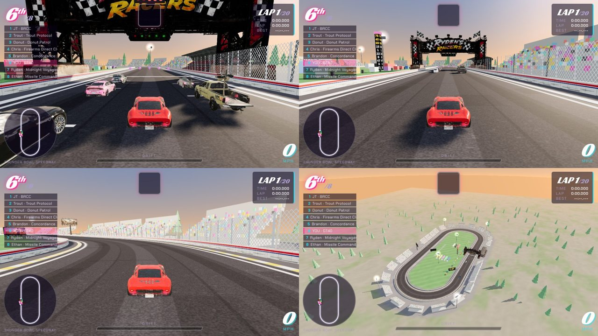

# Thunder Bowl Speedway (track `bowl`)

A small NASCAR-style short-track oval. Always 20 laps; no car bonuses; item boxes and boost pads are live.

| | |
|---|---|
| layout | two 210 m straights, two half circles of 68 m radius, 22 m wide, 0.85 km (a half-mile), driven counter-clockwise: left turns only. `ovalPoints()` generates the 40 control points |
| laps | `laps:20`. AI laps 14-17 s on Hard: about 5.5 minutes |
| no car bonuses | `noPerks:true` (same rule as every 20-lap track) |
| pick-ups | item rows in the middle of each straight; boost pads at the exits of turn 2 (two, side by side) and turn 4 |
| Grand Prix | `gp:false` |
| look | `THEMES.oval` (golden hour): rubbered-in asphalt with no centre line, white SAFER-style wall with a red and blue stripe, yellow/white apron, catch fence with posts, grandstands with a crowd all the way round, six light towers, pit road with stalls and pit boxes, haulers, the logo mown into the striped infield, a scoring pylon, Pepperbox boards, trees beyond |
| cost | 55 draw calls in the solo test shot; the stands and the crowd are two instanced meshes |

Flat, not banked: the physics has no road roll, so banking would only be cosmetic.

## Leaderboard (Supabase)

`bowl` must be allowed in `race_results_track_check`; laps here are 14-17 s, so this track needs its own floors: lap >= 10 s, race >= 200 s.
