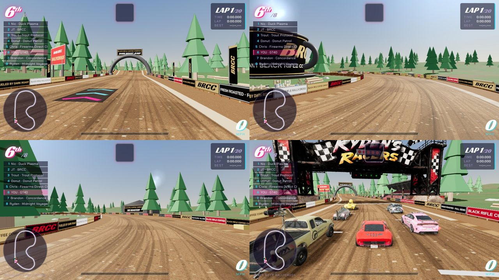
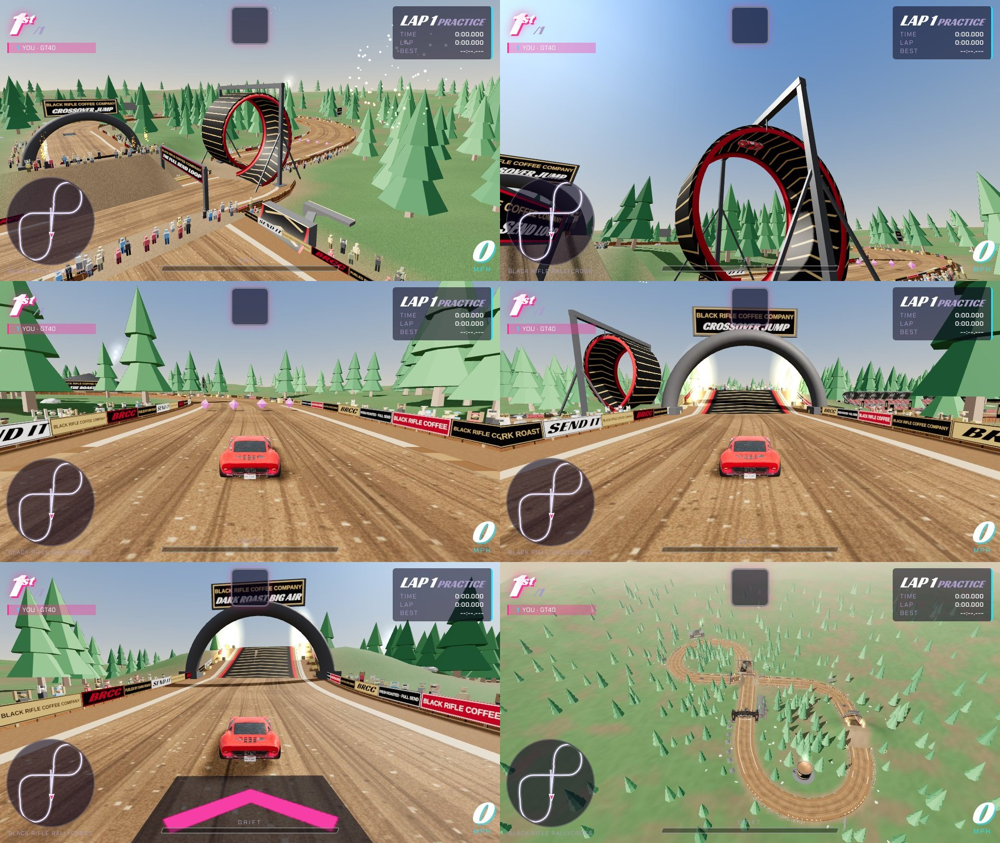

# Black Rifle Rallycross (track `roast`)

A short, fast dirt stage through pine forest, dressed as if Black Rifle Coffee Company sponsored every metre.
Always 20 laps; no car bonuses; item boxes and boost pads are live.

| | |
|---|---|
| layout | rev 2: a 1.17 km figure-8 dirt stage, 16-17 m wide. The start straight runs under the Crossover Jump, then the Full Send Loop, the esses and hairpin, back over the start straight in the air, and the Dark Roast Big Air before the line |
| Crossover Jump | `{cp:14,f:0.48,len:16,h:4.6,gap:32}`: a gap jump that flies over the start straight (the road you drive later in the lap). `flatGaps:true` keeps the terrain under the gap at the lower road's height; cars more than 1.8 m apart in height do not collide |
| Dark Roast Big Air | `{cp:19,f:0.35,len:22,h:6.5,gap:30}`: the big one, 6.5 m kicker |
| Full Send Loop | `loop:{cp:4,f:0,cpx:5,fx:0,r:11,w:11}`: a helix loop like the skateboard one, in on one lane and out on another 13 m to the side. The physics is path-relative and flat, so the loop is a stunt on rails: `Race.loopEnter` / `loopStep` carry the car round (`P.loop.pos`), the road samples under it are `P.hidden`, the camera swings to the side, and the car is put back on the road one sample past the exit with its speed (`loopCD` stops it being picked up again) |
| pyrotechnics | `W.pyro(q,car)`: flame jets on both jump lips and the loop mouth, sparks, and shell bursts overhead when a car hits the lip |
| dirt | `THEMES.rally` + `dirtRoad`: packed-dirt road texture with ruts and loose stones, no paint, dirt shoulders, wooden fence; `dirt:true` makes every car trail dust on the road itself. Looks only: grip is the same as on every track |
| laps | `laps:20`. AI laps 26-28 s on Hard: about 9 minutes. Six-lap test with the full field: no respawns, 40 clean loop passes |
| no car bonuses | `noPerks:true` |
| pick-ups | pads and item rows only on the start straight and the run back from the hairpin (in the sweeper and the esses they put the AI in the fence) |
| Grand Prix | `gp:false` |
| Black Rifle | banners on both fences for the whole lap, the jump arch, THE MUG (a 14 m black coffee mug with steam inside the hairpin), the roastery barn with chimney smoke, bean sacks and barrels, a service park of black canopies, feather flags down the start straight, four sponsor boards, spectators in brand colours |
| cost | 98 draw calls, 633k triangles in the solo test shot |

## Brand art

Everything Black Rifle on this track is **plain lettering** in black, tan and red (the company name, "BRCC", and lines written
for the game). No official logo artwork is used. To put the real marks on: replace the canvas atlas in the `rally` block of
`buildScenery` (`panels`, 2 rows x 4 panels of 512x128) with an image, the way `sponsors.jpg` is used at PepperBox Raceway.

## Leaderboard (Supabase)

The layout changed, so times post under `roast_r2` (`rev:2`). It must be allowed in `race_results_track_check`; floors: lap >= 18 s, race >= 360 s. Old `roast` times stay on the old board.
