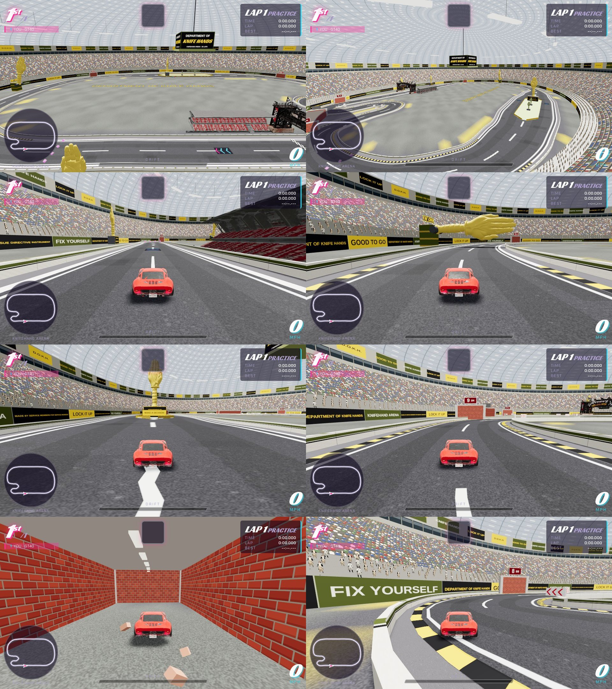

# Knifehand Arena (track `knife`)

The fourth 20-lap track, built for the Department of Knife Hands: an indoor circuit under one roof, well lit, with the
knifehand everywhere. Always 20 laps; no car bonuses; item boxes and boost pads are live. It joins the Marathon Grand Prix
automatically (every track with `laps:20`).

| | |
|---|---|
| layout | rev 2, 1.02 km (`knifePoints`): a small jump off the line, the east sweeper climbing 11 m under the Chop, the raised north straight that splits round the island, down the west leg through the Old Quarter, a short infield hairpin and a U-turn home. AI laps 22-25 s on Hard, about 8 minutes |
| the megadome | theme `arena` (`buildArenaScenery`): a science-fiction arena far larger than a building could be. The floor edge is an ellipse 250 m beyond the track; six stacked crowd tiers with light bands between them, a lettered rim wall and a hexagon-lattice roof 700 m up are bands swept round it. Light pylons, glowing rings set in the deck, dark machinery blocks with light strips |
| near the track | a hovering LED board round the outside of the lap with the Department's lines, light gates the road passes through, a 130 m hologram knifehand turning over the infield |
| the crowd | about 1,100 instanced colonials (continental, militia, French) from `rv_troops.glb`, lowest LOD, on ten hovering grandstands beside the road, one in three bobbing. The far tiers are a painted crowd in the same colours |
| the knifehand | `models/props/knifehand.glb` (the Meshy model, 232k triangles simplified to 8k, no texture; coloured in game): the 25 m gold monument on the nose of the island, a row of olive ones down the island, two beside the start straight, the hologram, and the Chop |
| the Chop | a giant knifehand on a tower outside the east sweeper (cp 4) that raises and chops down across the road every 3.4 s. It stops 7 m above the road: it shakes the camera and thumps, it does not hit cars |
| the split | cp 7-10: the road widens to 46 m round a 20 m island (`medians:[{cp:7,f:0.55,len:100,w:20}]`), a boost pad in each lane. AI lines hold the middle of a lane for the whole island when a median is wider than 10 m |
| the Old Quarter | a preserved brick street inside the dome: numbered brick houses down both sides of the west leg and round the infield and U-turn, lamp posts, a brick arch on the way in. This is where the shortcut lives |
| road lettering | "DeptKnifehands.com" painted on the road in seven places (strips that follow the road surface, bottom of the lettering toward oncoming cars) |
| leaderboard | times post under `knife_r2` (`rev:2`); it must be allowed in `race_results_track_check`; floors: lap >= 12 s, race >= 240 s |

## The shortcut (`def.shortcut`, `P.sc`, `Race.scEnter` / `scStep`)

An ode to old racing games. At the end of the Old Quarter street the road bends left into the infield; straight on is one more brick
house, number 9 3/4, the only one with no windows. `buildTrackPath` walks the straight-on line from the sample at `cp,f` until it leaves the road: that is the wall
point. A human driver who arrives within 5 m of it, pointing at it (within 15 degrees) and doing more than 10 m/s, is carried
on rails along a cubic curve through a brick passage, braking on the way out, and put back on the road part-way round the
U-turn (`cpx:21,fx:0.55`) at `vOut` (23 m/s), slow enough to make the rest of the turn. The door is slid back until no part
of it is on the road, the passage starts where both its walls are clear of the road, and the way out is an open archway. Bricks fly, the screen says PLATFORM 9 3/4.

- It cuts 150 m of road (the infield hairpin) down to about 55 m: roughly 4 seconds a lap.
- AI cars never take it (`c.isPlayer` only, and not under autopilot).
- The lap gates inside the part that was cut are credited on the way out, so the lap counts.
- Miss the wall, or arrive at an angle, and it is just the outside wall of the corner.
- The physics is path-relative, so the tunnel is not driveable road: the car is steered for you while inside.

## Brand art

Plain lettering only (the Department's name, its "Made by service members for service members" line and phrases written for
the game) in olive, black and yellow. No logo artwork is used. The knifehand model was supplied by the track's owner.
