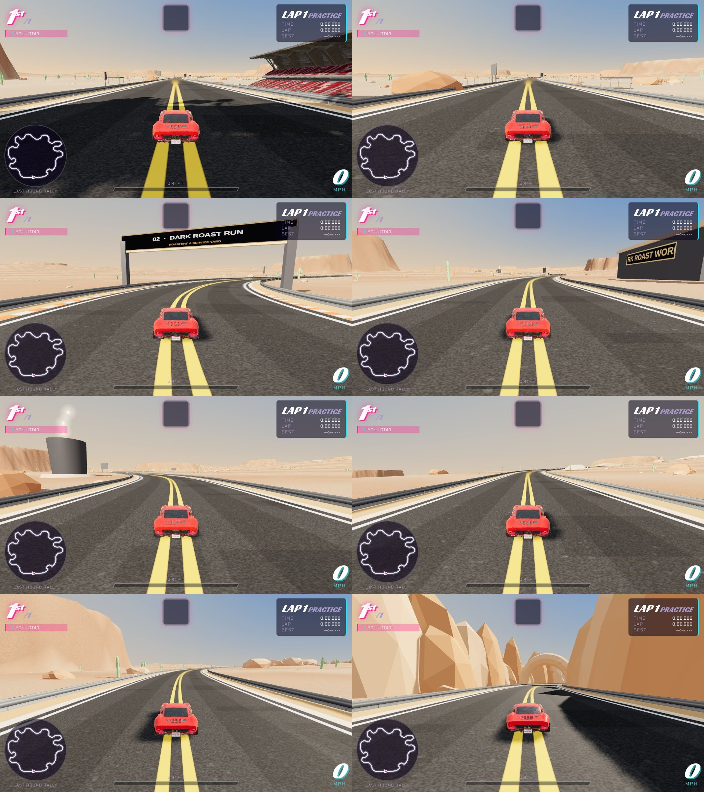
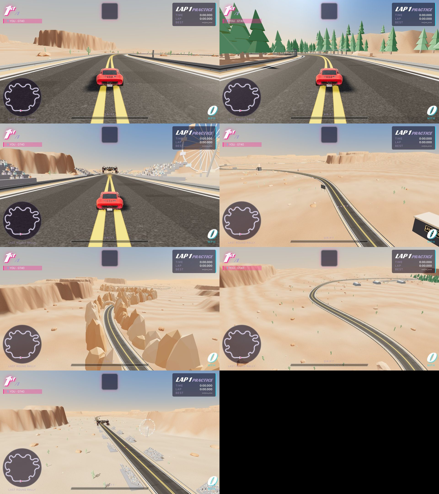

# Last Round Rally (track `last_round`)

A one-lap, 17.2 km endurance track through eight districts. The route came from an outside design pack ("Last Round Rally
Design Pack": control points in `track-definition.json`, sector sample ranges in `route-samples.json`; this builder reproduces
its 8,600 samples exactly). The pack's Blender/GLB scenery was a plain-box blockout and is not used; the districts are dressed
in code (`buildJourneyScenery`).

| | |
|---|---|
| race | `laps:1`, `noPerks:true`, `gp:false`, 18-26 m wide, 205 m of climb, 5 boost pads, 8 item rows |
| measured | full eight-car race, autopilot player: Hard 5:11-5:31, Normal 5:24-5:31, no respawns. Inside the 5-7 minute target; a human driver will be slower than the autopilot |
| land | `terrainFollow`: the ground is a field of distance-weighted road heights (the land rises with the road instead of the road standing on a 200 m embankment), with 46 sandstone mesas placed clear of the road and ranges far out. Terrain mesh capped near 170k vertices |
| districts | `def.sectors` (name, subtitle, colour, first sample). A gantry with number and name opens each one; distance boards every kilometre count down to the festival |
| 1 Creator Row | Pepperbox paddock: orange and black canopies, flags, eight Pepperbox show boards |
| 2 Dark Roast Run | the Dark Roast Works roastery with copper silos and a smoking chimney, a giant mug, six BRCC bag boards |
| 3 The Proving Grounds | earth berms with steel targets, an olive viewing tower, range sign |
| 4 Brass Ridge | sandstone outcrops, a red and white radio mast with a blinking light at the summit |
| 5 Echo Canyon | sandstone walls both sides for the whole district, a rock arch over the road |
| 6 Hangar Straight | a retired runway beside the straightest stretch, three hangars, a control tower, parked planes |
| 7 Ridgeback Trail | 1,300 pines, a terraced quarry, steel bridge trusses along the road |
| 8 Last Call | ten grandstands of fans down the run to the line, festival tents, a turning ferris wheel, Pepperbox boards |
| cost | about 820k triangles in the scene at the grid. Instanced scenery is cut into 600 m tiles and tiles and landmarks more than about 1.5 km from the camera are hidden |
| leaderboard | `last_round` must be allowed in `race_results_track_check`; floor: race (and lap) >= 240 s |
