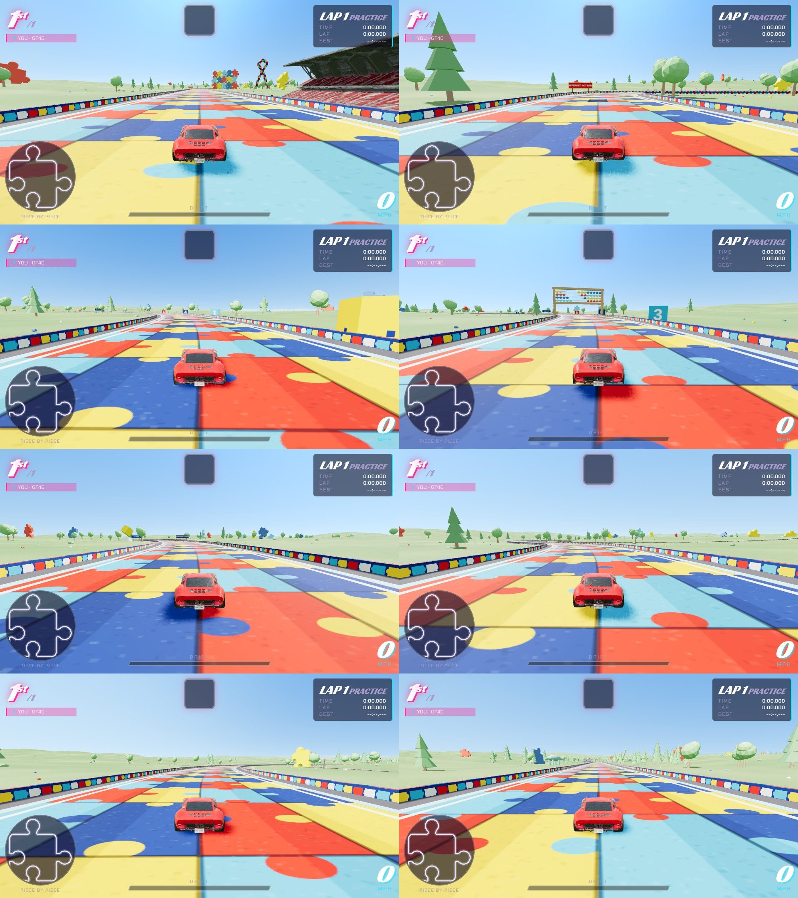
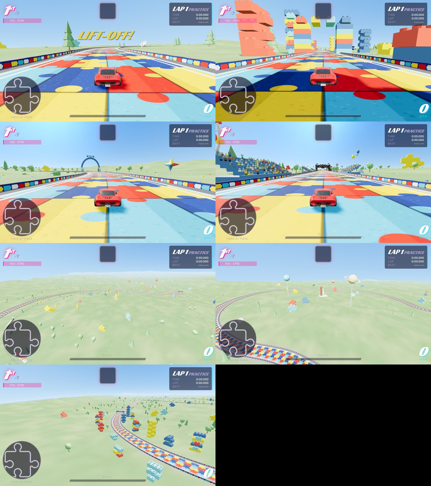
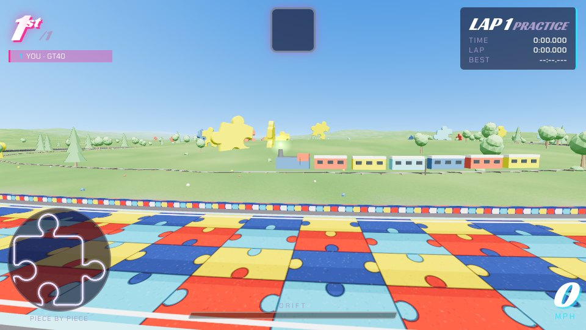

# Piece by Piece (track `puzzle`)

An autism awareness rally: one lap, 18 km, 5-7 minutes. It replaces the first one-lap design (Last Round Rally, a desert
route from an outside design pack, retired before it was rebuilt; its leaderboard key `last_round` stays in the database).

| | |
|---|---|
| outline | the lap is a puzzle piece: a 2.8 km square with round tabs on the right and top and blanks on the bottom and left (390 m knob radius, 470 m neck). Generated as a polyline (straights, 260 m corner arcs, necks, 270-degree knob arcs) and resampled to 150 control points; the minimap shows the piece |
| colours | the classic awareness palette only: red `#e2231a`, yellow `#ffd200`, light blue `#3cb4e5`, navy `#1b3f8b`. No rainbow anywhere |
| road | `th.puzzleRoad`: the surface is interlocking jigsaw pieces, four across and four every 26 m, no two neighbours the same colour, knobs alternating in and out, outlined; the texture tiles along the road. Curbs red and yellow, a navy wall with coloured pieces |
| race | `laps:1`, `noPerks:true`, `gp:false`, 22 m wide (26 m on the start straight), 50 m climb to Space Ridge. Full field on Hard: 5:17-5:50, no respawns |
| land | `terrainFollow` + `hills`: meadow that rises with the road, rolling hills further out, trees, flower patches in the palette, giant puzzle pieces lying in the fields |
| districts | 1 Awareness Avenue (a wall of interlocking pieces, a giant awareness ribbon in puzzle colours) · 2 The Math Mile (pi in giant digit blocks, the five Platonic solids turning on plinths, an abacus over the road, a Fibonacci spiral, equation boards, kilometre boards that say when the number left is prime) · 3 Train Town (a railway round the inside of the right tab, a locomotive and six cars going round the same way you do; race it) · 4 Dino Valley (brachiosaurus, T. rex, stegosaurus) · 5 Space Ridge (a rocket in the top tab that lifts off when you arrive, planets on pylons, dishes) · 6 Block City (towers of giant toy bricks sorted by colour, a brick arch over the road) · 7 The Quiet Garden (hedges, flowers, slow pinwheels, fountains, giant ear defenders over the road, QUIET ZONE) · 8 Acceptance Festival (grandstands of fans, tents, balloons, a ferris wheel) |
| messages | DIFFERENT, NOT LESS · EVERY MIND COUNTS · YOU BELONG HERE · BE KIND, BE PATIENT · AUTISM AWARENESS · BUILD EACH OTHER UP · QUIET ZONE AHEAD · ACCEPTANCE, EVERY PIECE MATTERS. All boards face the oncoming driver |
| secret | five golden puzzle pieces near the edge of the road (Math Mile, Train Town, Space Ridge, Block City, Quiet Garden). Drive through one: a small boost and GOLDEN PIECE n / 5; all five: a shower of sparks |
| cost | about 750k triangles and 290 draw calls in view. Instanced scenery in 1.2 km tiles, tiles and landmarks more than about 1.25 km away hidden; static landmark parts merged into one mesh per material |
| leaderboard | `puzzle` must be allowed in `race_results_track_check`; floor: race (and lap) >= 240 s |
| even CPUs | `evenCpu:true` (this track only): a CPU car's top speed is capped at the player's car top speed. Skill and catch-up bonuses can lower it but never raise it; boosts and pads still work. Cornering and AI lines unchanged. Other tracks are not affected |
